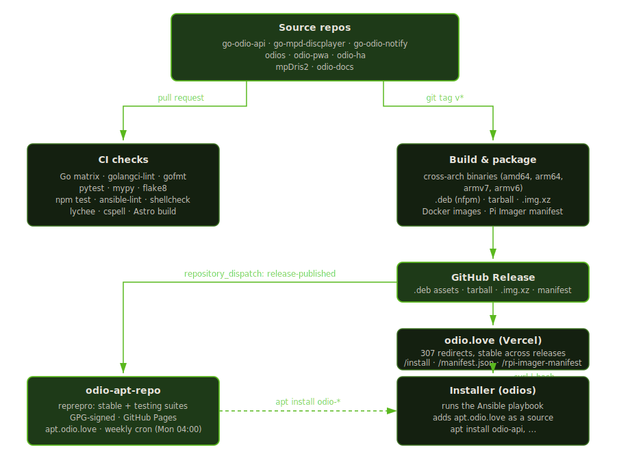
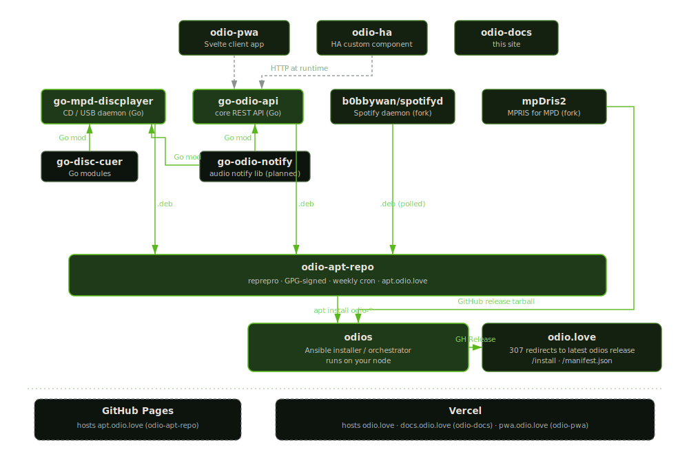

import { Aside } from '@astrojs/starlight/components';

CI that isn't explained is still public, just harder to read. Contributors end up crawling nine different `.github/workflows/` folders to piece together what a `v*` tag actually does, which makes both onboarding and transparency harder than they need to be.

The whole pipeline runs on [GitHub Actions](https://github.com/features/actions). Every workflow file is linked from the sections below, and the path from a tag on [go-odio-api](https://github.com/b0bbywan/go-odio-api) to a signed `.deb` on your Pi is short enough to trace end to end. Fork any component, set two secrets (a PAT scoped to your apt-repo fork and a GPG key for signing), and the same automation runs on your side.

## CI on every pull request

Nothing merges to `main` without the relevant checks running green. The details vary by language:

- **Go repos** ([go-odio-api](https://github.com/b0bbywan/go-odio-api/blob/main/.github/workflows/ci.yml), [go-odio-notify](https://github.com/b0bbywan/go-odio-notify/blob/main/.github/workflows/ci.yml)) run a matrix across Go 1.24 and 1.25: `go test -race`, coverage gate (15% minimum, uploaded to [Codecov](https://about.codecov.io/) on 1.25), [golangci-lint](https://golangci-lint.run/) v2.5.0, `gofmt`, and a `go mod tidy` drift check. `go-odio-api` also compiles the embedded Tailwind CSS via [Task](https://taskfile.dev/) before the test/lint steps, because the binary ships the UI as an embedded asset.
- **[odio-pwa](https://github.com/b0bbywan/odio-pwa/blob/main/.github/workflows/ci.yml)** runs `npm test` on Node 22.
- **[odio-ha](https://github.com/b0bbywan/odio-ha/blob/master/.github/workflows/ci.yml)** runs `flake8`, `mypy`, and `pytest` across Python 3.13 and 3.14.
- **[odios](https://github.com/b0bbywan/odios/tree/main/.github/workflows)** runs a unified [`checks.yml`](https://github.com/b0bbywan/odios/blob/main/.github/workflows/checks.yml) workflow combining `ansible-lint`, `shellcheck` (installer, test, and image-builder shell scripts), and Python `unittest` against `tests/` (covering the upgrade helper and `state.json` schema). It exposes a `workflow_call` trigger so the release pipeline gates publishing on the very same checks.
- **[odio-docs](https://github.com/b0bbywan/odio-docs/blob/main/.github/workflows/lint.yml)** builds the Astro site, runs [lychee](https://github.com/lycheeverse/lychee-action) for broken links, and [cspell](https://cspell.org/) on every `.md` / `.mdx` file.

## The component release chain

odio's packaged components, [go-odio-api](https://github.com/b0bbywan/go-odio-api) and [go-mpd-discplayer](https://github.com/b0bbywan/go-mpd-discplayer), produce `.deb` artifacts on tag. The flow is:

1. A `v*` tag gets pushed.
2. The repo's `build.yml` cross-compiles for amd64, arm64, armv6, and armv7, then runs [nfpm](https://nfpm.goreleaser.com/) to pack `.deb` files (and `.rpm` in the case of go-odio-api).
3. A [GitHub Release](https://github.com/b0bbywan/go-odio-api/releases) is created with every `.deb` attached.
4. A `notify-apt-repo` job fires a `repository_dispatch` event of type `release-published` to [odio-apt-repo](https://github.com/b0bbywan/odio-apt-repo), signed with a dedicated `APT_REPO_TOKEN`.

[odio-apt-repo](https://github.com/b0bbywan/odio-apt-repo/blob/master/.github/workflows/update-repo.yml) receives the dispatch and rebuilds from scratch:

- `gh release list` resolves the latest stable and latest prerelease for `go-odio-api`, `go-mpd-discplayer`, and [spotifyd](https://github.com/b0bbywan/spotifyd) (an odio-tracked fork, polled on each run).
- Every `.deb` is downloaded fresh.
- [`reprepro`](https://salsa.debian.org/debian/reprepro) assembles two suites, `stable` and `testing`, across `amd64`, `arm64`, `armhf`, and `armv7hf`.
- The tree is GPG-signed with `GPG_PRIVATE_KEY`, written with a `CNAME` for `apt.odio.love`, and deployed via [GitHub Pages](https://pages.github.com/).

A weekly cron runs the same workflow every Monday at 04:00 UTC as a safety net, so a missed dispatch can never leave the repo stale for more than a week. The workflow can also be triggered manually with explicit version overrides.

## odios releases

[odios](https://github.com/b0bbywan/odios) uses a different track: it ships the installer, not `.deb` packages. On a CalVer tag like `2026.4.1`, [`release.yml`](https://github.com/b0bbywan/odios/blob/main/.github/workflows/release.yml) runs a long pipeline that:

- Gates the `build` job on the shared [`checks.yml`](https://github.com/b0bbywan/odios/blob/main/.github/workflows/checks.yml) workflow (ansible-lint, shellcheck, Python unit tests), so a red lint or test never produces a release.
- Vendors `ansible-core` as pure Python, strips platform-specific bits, and packs an `odio-<version>.tar.gz` alongside `install.sh` and a `manifest.json`.
- Runs the playbook on `ubuntu-latest`, native ARM64, and ARM/v7 + ARM/v6 under [QEMU](https://www.qemu.org/), with an idempotence rerun.
- Runs `test.sh` in `install` and `install-root` modes against the just-published pre-release, which exercises the full `curl | bash` installer path end to end.
- Runs an upgrade matrix on `arm64` against three pre-provisioned baselines (`2026.4.0rc3`, `2026.4.1rc1`, `2026.4.1rc2`), one per state-schema generation, so every supported upgrade path is exercised before publication. Baselines live as Docker images at `ghcr.io/b0bbywan/odios/test-baseline:<tag>-<arch>`, rebuilt once on demand via [`test-baseline-image.yml`](https://github.com/b0bbywan/odios/blob/main/.github/workflows/test-baseline-image.yml). Skipping the baseline install brings each upgrade run from ~1h down to ~25min.
- Builds Raspberry Pi images (`odio-*.img.xz`) for `armhf` and `arm64` via `image-builder/build.sh`.
- Publishes a combined [Raspberry Pi Imager](https://www.raspberrypi.com/software/) manifest (`odio.rpi-imager-manifest`) as a release asset, so the images show up inline in the Imager UI. Pre-releases also publish per-arch manifests (`odio.armhf.rpi-imager-manifest`, `odio.arm64.rpi-imager-manifest`), so a PR can be tested in Imager as soon as one arch is built, without waiting for the other.

Pull requests to odios run the same matrix against a `pr-<N>` pre-release instead of the tag, which means the install path you'd take is tested before merge, not only before release.

All of it lands on a single [GitHub Release](https://github.com/b0bbywan/odios/releases). The URLs users hit, `beta.odio.love/install`, `/manifest.json`, and `/odio.rpi-imager-manifest`, are 307 redirects served by the [odio.love](https://github.com/b0bbywan/odio.love) Astro site on Vercel, pointing at `github.com/b0bbywan/odios/releases/latest/download/<asset>`. The URLs stay stable across releases, so `curl -fsSL https://beta.odio.love/install | bash` never needs updating. Pinning a specific version means calling the GitHub URL with the tag directly, as shown in [Upgrade](/guides/upgrade/).

## PWA and Home Assistant

[odio-pwa](https://github.com/b0bbywan/odio-pwa) releases on `v*` tags. [`release.yml`](https://github.com/b0bbywan/odio-pwa/blob/main/.github/workflows/release.yml) zips the Astro `dist/` as `odio-pwa-<version>.zip`, and publishes multi-arch Docker images (amd64 + arm64) to `ghcr.io/b0bbywan/odio-pwa`. Prereleases (tags containing `-`) are marked as such on GitHub; only stable releases move the `:latest` tag on the container registry.

[odio-ha](https://github.com/b0bbywan/odio-ha) uses a two-step pattern: a semver-tagged push runs the [CI workflow](https://github.com/b0bbywan/odio-ha/blob/master/.github/workflows/ci.yml), and a [separate workflow](https://github.com/b0bbywan/odio-ha/blob/master/.github/workflows/release.yml) waits for CI to succeed via `workflow_run` before creating the release. Prerelease detection is based on the tag suffix (`-alpha`, `-beta`, `-rc`).

## Secrets and trust

The pipeline relies on two scoped secrets:

- `APT_REPO_TOKEN`, a personal access token with `repo` scope on `b0bbywan/odio-apt-repo`. Held by component repos so they can fire cross-repo dispatches. Nothing else can trigger the apt-repo rebuild from outside.
- `GPG_PRIVATE_KEY`, held only by `odio-apt-repo`. Used by `reprepro` to sign the `Release` files, so `apt` clients on every odio node can verify the signature chain before installing anything.

Everything else (creating GitHub Releases, downloading release assets in another repo, deploying to Pages) uses the default `GITHUB_TOKEN` scoped to each workflow run.

## Manual verification on hardware

On top of the automated matrix, release candidates are run by hand on real Raspberry Pi hardware before the final tag, currently a Pi B+ (armv6) and a Pi 3B (arm64). Transcripts of these sessions, Ansible `PLAY RECAP` outputs with `failed=0`, playbook durations (from around 9 minutes on a fresh node to nearly 2 hours on a busy one), and the upgrade paths walked from `dev-*` builds through each `2026.4.1rc*` to the final tag are kept publicly in the [upgrade-system RFC](https://github.com/b0bbywan/odios/discussions/34).

## What this gets you

The apt repository at `apt.odio.love` is always built from tagged source, by the same toolchain, on every component release. There is no manual step where a binary gets dropped into the repo by hand. That's the guarantee users rely on when they let `apt upgrade` pull new odio packages overnight.

The ARM builds in particular exist because cross-compilation failures are easy to miss without CI. The odios installer is tested under QEMU against the very release it's about to publish, so a tag that doesn't install cleanly on a Pi fails in CI instead of on your SD card.

Everything above is public. If you want to understand why a given release landed when it did, or audit what's in it, the workflow runs and the release notes are the source of truth.

## Repository overview

The ecosystem is eleven repositories, most connected to each other at build time (Go modules, `.deb` ingest into the apt repo, tarball fetch at install time) or at runtime (client apps hitting the API over HTTP). Green solid edges are build or install time, grey dashed edges are runtime. The hosting row at the bottom shows which platform serves each public endpoint: GitHub Pages for `apt.odio.love`, Vercel for everything else.

| Repo | CI | Release output | Role in the ecosystem |
|---|---|---|---|
| [go-odio-api](https://github.com/b0bbywan/go-odio-api) | Go matrix, lint, coverage, CSS build | `.deb` + `.rpm` (4 arches), multi-arch GHCR image | Core REST API, installed on every node via `apt install odio-api`. Consumed at runtime by `odio-pwa` and `odio-ha` over HTTP |
| [go-mpd-discplayer](https://github.com/b0bbywan/go-mpd-discplayer) | Build matrix | `.deb` (4 arches) | CD / USB auto-play daemon, installed via `apt install mpd-discplayer`. Embeds `go-disc-cuer` as a Go module |
| [go-disc-cuer](https://github.com/b0bbywan/go-disc-cuer) | (no workflows) | Go library | CUE sheet + GnuDB / MusicBrainz lookup, compiled into `go-mpd-discplayer` |
| [go-odio-notify](https://github.com/b0bbywan/go-odio-notify) | Go matrix, lint, coverage | Cross-arch binaries | Shared audio notification lib. Planned as Go module dependency for `go-odio-api` and `go-mpd-discplayer` |
| [odios](https://github.com/b0bbywan/odios) | ansible-lint, shellcheck, playbook + install tests | Installer tarball, Pi images, Imager manifest | Orchestrator. Adds `apt.odio.love` as a source, installs `odio-api`, `mpd-discplayer`, `spotifyd`, plus `mpDris2` from its GitHub release tarball |
| [odio-pwa](https://github.com/b0bbywan/odio-pwa) | `npm test` | Zip archive, multi-arch GHCR images | Standalone client app, talks to `go-odio-api` over HTTP at runtime |
| [odio-ha](https://github.com/b0bbywan/odio-ha) | flake8, mypy, pytest | GitHub Release, CI-gated | Home Assistant custom component, talks to `go-odio-api` over HTTP at runtime |
| [mpDris2](https://github.com/b0bbywan/mpDris2) (fork) | autogen + make | Source tarball | Pulled by odios from the GitHub release tarball, not packaged in the apt repo |
| [odio-apt-repo](https://github.com/b0bbywan/odio-apt-repo) | receives dispatches, weekly cron | `apt.odio.love` via GitHub Pages | Ingests `.deb` from `go-odio-api`, `go-mpd-discplayer`, and [b0bbywan/spotifyd](https://github.com/b0bbywan/spotifyd) (fork, polled on each run) |
| [odio.love](https://github.com/b0bbywan/odio.love) | auto-deployed by Vercel on push | Stable 307 redirects | Serves `/install`, `/manifest.json`, `/odio.rpi-imager-manifest` from the latest `odios` GitHub Release |
| [odio-docs](https://github.com/b0bbywan/odio-docs) | Astro build, lychee, cspell | Deployed separately | This site |

<Aside type="tip">Something in this pipeline could be better? Open an [issue on odio-docs](https://github.com/b0bbywan/odio-docs/issues) or start a [discussion on odios](https://github.com/b0bbywan/odios/discussions).</Aside>
