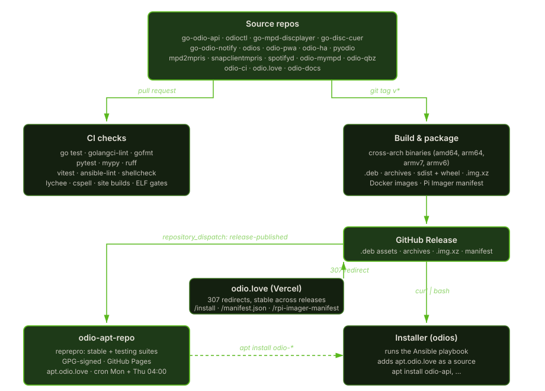
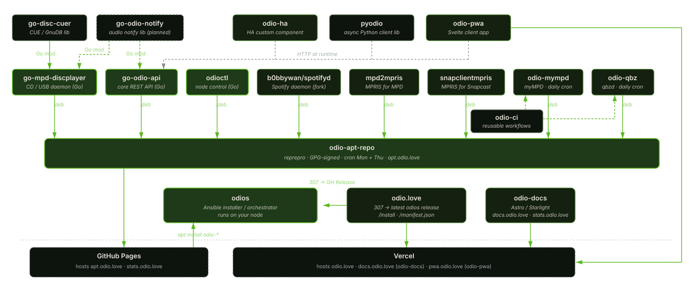

import { Aside } from '@astrojs/starlight/components';

You don't need to know the whole CI/CD pipeline to contribute to odio. The sections below cover it piece by piece, with the workflow files linked inline, so you can jump straight to the part you care about. The pipeline runs on [GitHub Actions](https://github.com/features/actions); from a `v*` tag on a component repo to a signed `.deb` on [apt.odio.love](https://apt.odio.love), it's short enough to trace end to end whenever you do want the full view.

<figure>

</figure>

## CI on every pull request

Nothing merges to `main` without the relevant checks running green. The details vary by language:

- **Go repos** ([go-odio-api](https://github.com/b0bbywan/go-odio-api/blob/main/.github/workflows/ci.yml), [go-odio-notify](https://github.com/b0bbywan/go-odio-notify/blob/main/.github/workflows/ci.yml)) run a matrix across Go 1.24 and 1.25: `go test -race`, coverage gate (15% minimum, uploaded to [Codecov](https://about.codecov.io/) on 1.25), [golangci-lint](https://golangci-lint.run/) v2.5.0, `gofmt`, and a `go mod tidy` drift check. `go-odio-api` also compiles the embedded Tailwind CSS via [Task](https://taskfile.dev/) before the test/lint steps, because the binary ships the UI as an embedded asset.
- **[odio-pwa](https://github.com/b0bbywan/odio-pwa/blob/main/.github/workflows/ci.yml)** runs `npm test` on Node 22.
- **[odio-ha](https://github.com/b0bbywan/odio-ha/blob/master/.github/workflows/ci.yml)** runs `flake8`, `mypy`, and `pytest` across Python 3.13 and 3.14.
- **[odios](https://github.com/b0bbywan/odios/tree/main/.github/workflows)** runs a unified [`checks.yml`](https://github.com/b0bbywan/odios/blob/main/.github/workflows/checks.yml) workflow combining `ansible-lint`, `shellcheck` (installer, test, image-builder, and `scripts/`), Python `unittest` against `tests/` (covering the upgrade helper and `state.json` schema), and Python lint with [ruff](https://docs.astral.sh/ruff/) + [mypy](https://mypy.readthedocs.io/) on `odio_upgrade.py`. It exposes a `workflow_call` trigger so the release pipeline gates publishing on the very same checks.
- **[odio-docs](https://github.com/b0bbywan/odio-docs/blob/main/.github/workflows/lint.yml)** builds the Astro site, runs [lychee](https://github.com/lycheeverse/lychee-action) for broken links, and [cspell](https://cspell.org/) on every `.md` / `.mdx` file.

## The component release chain

Five upstream repos feed `.deb` into [apt.odio.love](https://apt.odio.love): the two Go components built in-house ([go-odio-api](https://github.com/b0bbywan/go-odio-api), [go-mpd-discplayer](https://github.com/b0bbywan/go-mpd-discplayer)), the [spotifyd](https://github.com/b0bbywan/spotifyd) and [mpDris2](https://github.com/b0bbywan/mpDris2) forks, and [odio-mympd](https://github.com/b0bbywan/odio-mympd). The flow is:

1. A `v*` tag gets pushed.
2. The repo's `build.yml` cross-compiles for amd64, arm64, armv6, and armv7, then packs `.deb` files via [nfpm](https://nfpm.goreleaser.com/) (Go components) or `dpkg-buildpackage` inside per-arch builder images (mpDris2, odio-mympd). go-odio-api also packs `.rpm`.
3. A [GitHub Release](https://github.com/b0bbywan/go-odio-api/releases) is created with every `.deb` attached.
4. A `notify-apt-repo` job fires a `repository_dispatch` event of type `release-published` to [odio-apt-repo](https://github.com/b0bbywan/odio-apt-repo), signed with a dedicated `APT_REPO_TOKEN`.

[odio-apt-repo](https://github.com/b0bbywan/odio-apt-repo/blob/master/.github/workflows/update-repo.yml) receives the dispatch and rebuilds from scratch:

- `gh release list` resolves the latest stable and latest prerelease for the five tracked repos: `go-odio-api`, `go-mpd-discplayer`, `spotifyd`, `mpDris2`, `odio-mympd`. Manual `workflow_dispatch` accepts an explicit version override per repo.
- Every `.deb` is downloaded fresh.
- [`reprepro`](https://salsa.debian.org/debian/reprepro) assembles two suites, `stable` and `testing`, across `amd64`, `arm64`, `armhf`, and `armv7hf`.
- The tree is GPG-signed with `GPG_PRIVATE_KEY`, written with a `CNAME` for `apt.odio.love`, and deployed via [GitHub Pages](https://pages.github.com/).

[odio-mympd](https://github.com/b0bbywan/odio-mympd) follows a build-only pattern: no source is vendored, just CI. A daily [`watch-upstream.yml`](https://github.com/b0bbywan/odio-mympd/blob/main/.github/workflows/watch-upstream.yml) cron polls [jcorporation/myMPD](https://github.com/jcorporation/myMPD) at 06:17 UTC and pushes a matching tag here when a new upstream release shows up. Tagging triggers `build.yml`, which cross-compiles myMPD inside per-arch builder images (rebuilt monthly via `build-images.yml`) and publishes the `.deb` Release that the apt repo then ingests. The `b0bbywan/spotifyd` fork carries no source changes either and will likely migrate to the same pattern when the appetite shows up.

A weekly cron runs the same workflow every Monday at 04:00 UTC as a safety net, so a missed dispatch can never leave the repo stale for more than a week. The workflow can also be triggered manually with explicit version overrides.

## odios releases

[odios](https://github.com/b0bbywan/odios) uses a different track: it ships the installer, not `.deb` packages. On a CalVer tag like `2026.4.1`, [`release.yml`](https://github.com/b0bbywan/odios/blob/main/.github/workflows/release.yml) runs a long pipeline that:

- Gates the `build` job on the shared [`checks.yml`](https://github.com/b0bbywan/odios/blob/main/.github/workflows/checks.yml) workflow (ansible-lint, shellcheck, Python unit tests, plus a role-drift check that fails any PR whose touched files don't match a role-version bump), so a red lint or test never produces a release.
- Vendors `ansible-core` as pure Python, strips platform-specific bits, and packs an `odio-<version>.tar.gz` alongside `install.sh` and a `manifest.json`.
- Runs the playbook on `ubuntu-latest` with an idempotence rerun, then a single-pass cross-arch sanity check on native ARM64 and on ARM/v7 + ARM/v6 under [QEMU](https://www.qemu.org/) (the ARM rerun was dropped to keep matrix runtime in check; ARM/v6 stays marked experimental).
- Runs `test.sh` in `install` and `install-root` modes against the just-published pre-release, which exercises the full `curl | bash` installer path end to end.
- Runs an upgrade matrix against pre-provisioned baselines covering every supported `state.json` generation, so each upgrade path is exercised before publication. The matrix walks three entry points: fetching the PR's `odio_upgrade.py` over `curl`, running the baseline's installed `/usr/local/bin/odio-upgrade`, and triggering `odio-upgrade.service` via `systemctl --user`. arm64 baselines come from the published SD images via [`scripts/img-to-docker.sh`](https://github.com/b0bbywan/odios/blob/main/scripts/img-to-docker.sh), also rebuilt on demand from [`test-baseline-image.yml`](https://github.com/b0bbywan/odios/blob/main/.github/workflows/test-baseline-image.yml). amd64 baselines are layered onto `Dockerfile.test` via [`scripts/build-baseline-amd64.sh`](https://github.com/b0bbywan/odios/blob/main/scripts/build-baseline-amd64.sh) so the systemctl path runs under real systemd-logind without QEMU emulation. All baselines live at `ghcr.io/b0bbywan/odios/test-baseline:<tag>-<arch>`.
- Builds Raspberry Pi images (`odio-*.img.xz`) for `armhf` and `arm64` via `image-builder/build.sh`.
- Publishes a combined [Raspberry Pi Imager](https://www.raspberrypi.com/software/) manifest (`odio.rpi-imager-manifest`) as a release asset, so the images show up inline in the Imager UI. Pre-releases also publish per-arch manifests (`odio.armhf.rpi-imager-manifest`, `odio.arm64.rpi-imager-manifest`), so a PR can be tested in Imager as soon as one arch is built, without waiting for the other.

Pull requests to odios run the same matrix against a `pr-<N>` pre-release instead of the tag, which means the install path you'd take is tested before merge, not only before release.

<figure>

</figure>

All of it lands on a single [GitHub Release](https://github.com/b0bbywan/odios/releases). The URLs users hit, `beta.odio.love/install`, `/manifest.json`, `/odio.rpi-imager-manifest`, and `odio.love/upgrade`, are 307 redirects served by the [odio.love](https://github.com/b0bbywan/odio.love) Astro site on Vercel, pointing at `github.com/b0bbywan/odios/releases/latest/download/<asset>`. The URLs stay stable across releases, so `curl -fsSL https://beta.odio.love/install | bash` never needs updating. Pinning a specific version means calling the GitHub URL with the tag directly, as shown in [Upgrade](/operations/upgrade/).

## PWA and Home Assistant

[odio-pwa](https://github.com/b0bbywan/odio-pwa) releases on `v*` tags. [`release.yml`](https://github.com/b0bbywan/odio-pwa/blob/main/.github/workflows/release.yml) zips the Astro `dist/` as `odio-pwa-<version>.zip`, and publishes multi-arch Docker images (amd64 + arm64) to `ghcr.io/b0bbywan/odio-pwa`. Prereleases (tags containing `-`) are marked as such on GitHub; only stable releases move the `:latest` tag on the container registry.

[odio-ha](https://github.com/b0bbywan/odio-ha) uses a two-step pattern: a semver-tagged push runs the [CI workflow](https://github.com/b0bbywan/odio-ha/blob/master/.github/workflows/ci.yml), and a [separate workflow](https://github.com/b0bbywan/odio-ha/blob/master/.github/workflows/release.yml) waits for CI to succeed via `workflow_run` before creating the release. Prerelease detection is based on the tag suffix (`-alpha`, `-beta`, `-rc`).

## Secrets and trust

The pipeline relies on two scoped secrets:

- `APT_REPO_TOKEN`, a personal access token with `repo` scope on `b0bbywan/odio-apt-repo`. Held by component repos so they can fire cross-repo dispatches. Nothing else can trigger the apt-repo rebuild from outside.
- `GPG_PRIVATE_KEY`, held only by `odio-apt-repo`. Used by `reprepro` to sign the `Release` files, so `apt` clients on every odio node can verify the signature chain before installing anything.

Everything else (creating GitHub Releases, downloading release assets in another repo, deploying to Pages) uses the default `GITHUB_TOKEN` scoped to each workflow run.

## Manual verification on hardware

On top of the automated matrix, two Raspberry Pis cover the manual checks, with split responsibilities:

- A **Pi 3B+** (arm64), a dedicated test rig, validates each PR. The [`pr-N` pre-release](#odios-releases) is run both as an upgrade from the previous release to the PR version, and as a reflash from the PR's image.
- A **Pi B+** (armv6) takes the post-publication upgrade path: every newly-tagged stable is applied to the previous one on this board, after the release ships. This is also the maintainer's production node, where a full playbook run takes around two hours, so it picks up upgrades on a post-publication cadence rather than mid-cycle.

Transcripts of these sessions, Ansible `PLAY RECAP` outputs with `failed=0`, and the upgrade paths walked are kept publicly in the [upgrade-system RFC](https://github.com/b0bbywan/odios/discussions/34). That discussion also captures many additional manual hardware runs done while the upgrade system was being built out, kept as design notes rather than a per-release routine.

## Repository overview

The ecosystem is eleven repositories, most connected to each other at build time (Go modules, `.deb` ingest into the apt repo, archives fetch at install time) or at runtime (client apps hitting the API over HTTP). Green solid edges are build, install, or deploy events; grey dashed edges are runtime. The hosting row at the bottom shows which platform serves each public endpoint: GitHub Pages for `apt.odio.love`, Vercel for everything else. Deploy arrows point from each hosted artifact down to its platform, and the `apt install` arrow goes from GitHub Pages back up to odios, since that's where the `.deb` actually lands at install time.

| Repo | CI | Release output | Role in the ecosystem |
|---|---|---|---|
| [go-odio-api](https://github.com/b0bbywan/go-odio-api) | Go matrix, lint, coverage, CSS build | `.deb` + `.rpm` (4 arches), multi-arch GHCR image | Core REST API, installed on every node via `apt install odio-api`. Consumed at runtime by `odio-pwa` and `odio-ha` over HTTP |
| [go-mpd-discplayer](https://github.com/b0bbywan/go-mpd-discplayer) | Build matrix | `.deb` (4 arches) | CD / USB auto-play daemon, installed via `apt install mpd-discplayer`. Embeds `go-disc-cuer` as a Go module |
| [go-disc-cuer](https://github.com/b0bbywan/go-disc-cuer) | (no workflows) | Go library | CUE sheet + GnuDB / MusicBrainz lookup, compiled into `go-mpd-discplayer` |
| [go-odio-notify](https://github.com/b0bbywan/go-odio-notify) | Go matrix, lint, coverage | Cross-arch binaries | Shared audio notification lib. Planned as Go module dependency for `go-odio-api` and `go-mpd-discplayer` |
| [odios](https://github.com/b0bbywan/odios) | ansible-lint, shellcheck, playbook + install + upgrade tests | Installer tarball, Pi images, Imager manifest | Orchestrator. Adds `apt.odio.love` as a source, installs `odio-api`, `mpd-discplayer`, `spotifyd`, `mpdris2`, `mympd` |
| [odio-pwa](https://github.com/b0bbywan/odio-pwa) | `npm test` | Zip archive, multi-arch GHCR images | Standalone client app, talks to `go-odio-api` over HTTP at runtime |
| [odio-ha](https://github.com/b0bbywan/odio-ha) | flake8, mypy, pytest | GitHub Release, CI-gated | Home Assistant custom component, talks to `go-odio-api` over HTTP at runtime |
| [mpDris2](https://github.com/b0bbywan/mpDris2) (fork) | autogen + make, then `dpkg-buildpackage` on tag | `.deb` (multi-arch) | Source fork carrying the [`as_directory`-aware](/disc-player/configuration/#cue-sheet-support) cover-art lookup for virtual CUE folders. Ingested into `apt.odio.love` |
| [odio-mympd](https://github.com/b0bbywan/odio-mympd) | builder images, multi-arch QEMU build | `.deb` (multi-arch) | Build-only pipeline (no source vendored). Daily cron tracks upstream [jcorporation/myMPD](https://github.com/jcorporation/myMPD); tagging here ships the matching myMPD `.deb` to `apt.odio.love` |
| [odio-apt-repo](https://github.com/b0bbywan/odio-apt-repo) | receives dispatches, weekly cron | `apt.odio.love` via GitHub Pages | Ingests `.deb` from `go-odio-api`, `go-mpd-discplayer`, [spotifyd](https://github.com/b0bbywan/spotifyd), [mpDris2](https://github.com/b0bbywan/mpDris2), and [odio-mympd](https://github.com/b0bbywan/odio-mympd) |
| [odio.love](https://github.com/b0bbywan/odio.love) | auto-deployed by Vercel on push | Stable 307 redirects | Serves `/install`, `/manifest.json`, `/odio.rpi-imager-manifest` from the latest `odios` GitHub Release |
| [odio-docs](https://github.com/b0bbywan/odio-docs) | Astro build, lychee, cspell | Deployed separately | This site |

<Aside type="tip">Something in this pipeline could be better? Open an [issue on odio-docs](https://github.com/b0bbywan/odio-docs/issues) or start a [discussion on odios](https://github.com/b0bbywan/odios/discussions).</Aside>

## Acknowledgments

- **The people whose work and thinking have inspired me** through odio's development.
- **Laurent T.**, for the Pi 3B+ used for per-PR testing, which keeps that loop off my production node.
- **[@vascoguita](https://github.com/vascoguita)**, for [raspios-docker](https://github.com/vascoguita/raspios-docker), the per-arch Raspberry Pi OS Docker images that every ARM `.deb` and the upgrade test images are built on top of. Specifically:
  - [go-mpd-discplayer's Dockerfile](https://github.com/b0bbywan/go-mpd-discplayer/blob/master/Dockerfile) cross-builds the CGO `.deb` for arm64/armhf inside `vascoguita/raspios:arm64` and `vascoguita/raspios:armhf` under QEMU.
  - [spotifyd's Dockerfile.builder](https://github.com/b0bbywan/spotifyd/blob/master/.github/Dockerfile.builder) uses the same bases for the `spotifyd-builder` image published to GHCR.
  - [odio-mympd's per-arch builders](https://github.com/b0bbywan/odio-mympd/blob/main/.github/workflows/build-images.yml) are rebuilt monthly on top of the same images.
  - [odios's test image](https://github.com/b0bbywan/odios/blob/main/tests/Dockerfile.test) targets the same bases so the upgrade matrix runs against a Pi-faithful environment, and [`scripts/img-to-docker.sh`](https://github.com/b0bbywan/odios/blob/main/scripts/img-to-docker.sh) derives the upgrade-test baselines following the same approach.