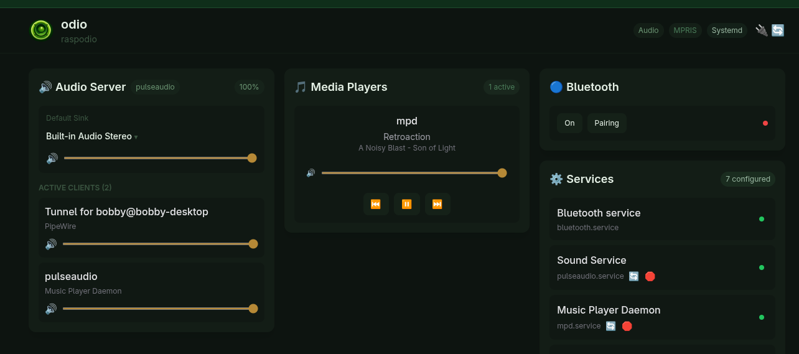
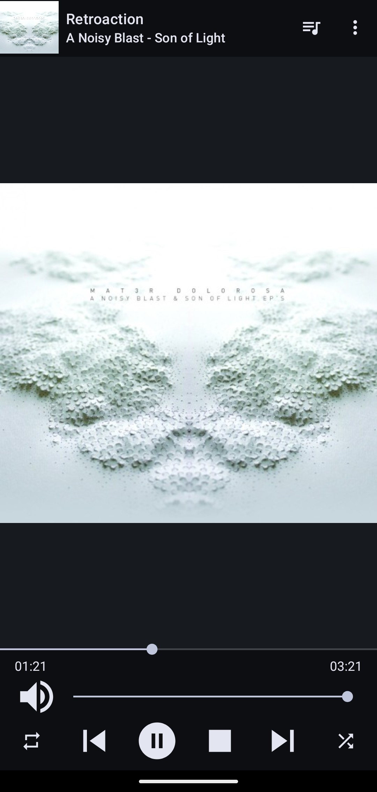
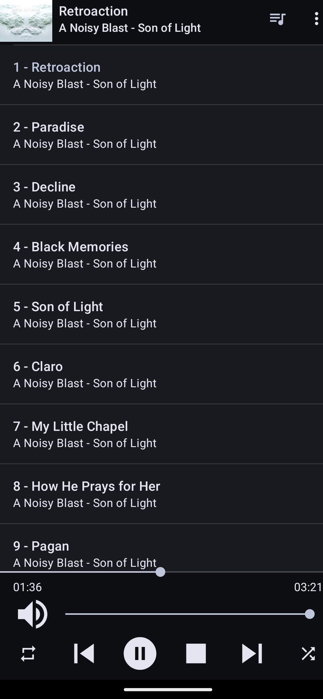

Plug a USB optical drive into your Pi. Insert a CD. Playback starts automatically with full track metadata and cover art via [go-mpd-discplayer](https://github.com/b0bbywan/go-mpd-discplayer).

go-mpd-discplayer is part of the [odio project](https://beta.odio.love) but is a standalone daemon — it works with any MPD setup. Cross-compiled binaries and deb packages are available on [GitHub releases](https://github.com/b0bbywan/go-mpd-discplayer/releases), and via the [odio apt repository](https://github.com/b0bbywan/odio-apt-repo).

## How it works

[go-mpd-discplayer](https://github.com/b0bbywan/go-mpd-discplayer) detects disc insertion, reads the disc ID, and queries [GnuDB](https://gnudb.org/) and [MusicBrainz](https://musicbrainz.org/) for artist, album, and track information. It generates a CUE sheet and feeds it to MPD. Individual tracks appear in the queue with their proper names.

When you eject the disc, the tracks are removed from the queue.

## Playback controls

CD playback is controlled like any other MPD source — from the odio application, Home Assistant, or any MPD client:

- Play / pause / stop / next / previous
- Seek within tracks
- Shuffle and repeat

> **Note:** Cover art is not yet displayed in the embedded UI for CD playback. mpDris2 does not currently forward cover art via MPRIS — this is a work in progress.

From an MPD client like MALP, cover art and full track metadata are available:

## Drive management

The drive speed is managed automatically: full speed during disc initialization, then reduced to 12x for quiet playback.
