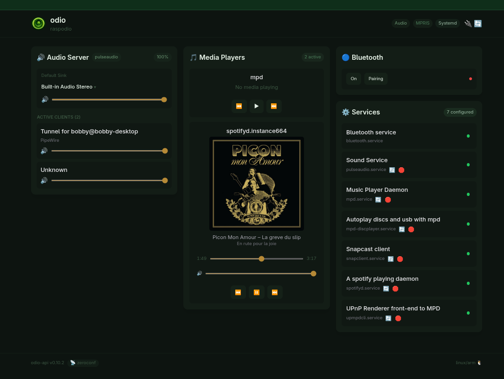

go-odio-api ships with an embedded web UI. No separate deployment, no build step — the API and the interface are the same process.

## Access

Open your browser and navigate to:

```
http://<ip>:8018/ui
```

Or via Zeroconf (mDNS):

```
http://<hostname>.local:8018/ui
```

No installation, no account. If you can reach your node on the network, you can control it.

## Features

The embedded UI provides the same controls as the application: playback, volume, Bluetooth, services, and power management. For a multi-node setup or an installable app experience, see the [odio application](/guides/pwa/).



## How it works

The UI is built with HTMX and Tailwind CSS, compiled into the Go binary via `go embed`. No build step, no CDN, no external requests — everything is served from the binary itself, 100% local.
