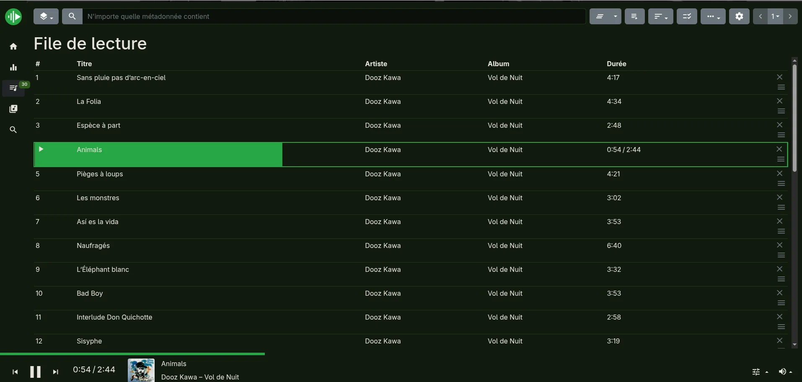

import { Image } from 'astro:assets';
import cdPlayback from '../../../assets/audio-cd-playback.webp';
import usbPlayback from '../../../assets/usb-playback.webp';
import webradioPlayback from '../../../assets/webradios-stream-cover.webp';
import mympdHome from '../../../assets/mympd-home.webp';

[MPD (Music Player Daemon)](https://www.musicpd.org/) is the local music player on your odio node. It handles [audio CD](/guides/audio-cd/), [USB flash drive](/guides/usb-flashdrives/) playback, and can also serve a full music library from a NAS.

## No library management by default

odio is designed as a streamer, not a library manager. A large music database on a Pi (especially older models like the B+) causes long scan times, high CPU usage, and corrupted database files — particularly over NFS.

By default, MPD only maintains a lightweight local database for [CD](/guides/audio-cd/) and [USB](/guides/usb-flashdrives/) playback via [go-mpd-discplayer](https://github.com/b0bbywan/go-mpd-discplayer).

If you want library browsing, [two options](#using-a-nas-library) are available: an NFS mount, or MPD running on the NAS.

## Playback controls

MPD exposes itself as an MPRIS player via [mpd2mpris](https://github.com/b0bbywan/mpd2mpris). This is what allows the odio API to discover and control MPD playback alongside all other sources. Playback is controllable from the embedded UI, the odio application, Home Assistant, or any MPD client.

The [mpd2mpris](https://github.com/b0bbywan/mpd2mpris) daemon shipped by odio walks an ordered cover-art pipeline: the embedded picture inside the audio file (MPD's `readpicture`), a regex-matched image in the song's directory, MPD's `albumart` resolver, a CUE/cdda fallback that looks next to the loaded `.cue` playlist when the current song is a virtual reference like `cdda://Disc/Track01` or `sheet.cue/trackNNNN`, and, when nothing local is found, remote cover-art URLs (MusicBrainz/CAA, iTunes or Deezer for tagged tracks; the station favicon or myMPD WebradioDB for web-radio streams). The remote steps expose the image URL as `mpris:artUrl` directly, so nothing is downloaded or cached to disk.

The CUE fallback is what makes cover art work for [audio CD playback](/guides/audio-cd/): MPD's CUE plugin is configured with `as_directory "true"`, which exposes the CUE sheet as a virtual directory, and the `cover.jpg` cached by [go-disc-cuer](https://github.com/b0bbywan/go-disc-cuer) sits next to it where the fallback finds it.

<div class="screenshot-carousel wide">
	<figure>
		<Image src={cdPlayback} alt="odio embedded UI playing an audio CD via MPD: Retroaction - A Noisy Blast - Son of Light, with album cover art and full transport controls" />
		<figcaption>CD playback in the embedded UI, cover art via mpd2mpris</figcaption>
	</figure>
	<figure>
		<Image src={usbPlayback} alt="odio embedded UI playing a USB flash drive via MPD: Dooz Kawa - Sans pluie pas d'arc-en-ciel from Vol de Nuit, with album cover art and transport controls" />
		<figcaption>USB stick playback, cover art served by odio-api v0.11.0+</figcaption>
	</figure>
	<figure>
		<Image src={webradioPlayback} alt="odio embedded UI playing a webradio via MPD, with the stream's album cover art and the artist and title shown alongside transport controls" />
		<figcaption>Webradio playback, album cover art resolved by mpd2mpris</figcaption>
	</figure>
</div>

## myMPD web UI

[myMPD](https://github.com/jcorporation/myMPD) ships as a sub-feature of the [`mpd` role](https://github.com/b0bbywan/odios/blob/main/installer/ansible/roles/mpd/tasks/mympd.yml) [since 2026.4.2b2](https://github.com/b0bbywan/odios/pull/52), running as a user systemd service themed in the [odio palette](https://github.com/b0bbywan/odios/blob/main/installer/ansible/roles/mpd/files/custom_css) and pointed at the local MPD. It tags along whenever MPD is installed (opt out with `INSTALL_MYMPD=N`), and the package itself comes from [odio-mympd](https://github.com/b0bbywan/odio-mympd), the build-only pipeline that tracks upstream and publishes `.deb` to [apt.odio.love](https://apt.odio.love).

Open it from any browser on the network:

```
http://<ip>:8080
```

Or via Zeroconf (mDNS):

```
http://<hostname>.local:8080
```

Since [2026.5.0b1](https://github.com/b0bbywan/odios/pull/56), the [odio API](/api/systemd/) also publishes the myMPD URL alongside `mpd.service`, so the [embedded UI](/control/embedded-ui/) and [odio application](/control/pwa/) link to it directly from their services list.

The home page surfaces four quick-access shortcuts: an odio icon that jumps back to the [embedded UI](/control/embedded-ui/), plus Webradios, Albums, and Artists views into the local library.

<Image src={mympdHome} alt="myMPD home page with four shortcut tiles: a green odio logo, Webradios with a radio icon, Albums with a disc icon, and Artists with a group icon" />

It covers the MPD-side use cases the embedded UI doesn't: queue editing, library browsing, tag-aware search.



- **[USB drives](/guides/usb-flashdrives/)** — browse and queue from any stick go-mpd-discplayer has indexed. The stick's content stays browsable as long as it's plugged in.
- **[CD library](/guides/audio-cd/)** — every CD that's been inserted before shows up as a virtual directory (CUE sheets cached in MPD's music directory by [go-disc-cuer](https://github.com/b0bbywan/go-disc-cuer), exposed via MPD's CUE plugin with `as_directory "true"`). Browsing works offline, but playback still needs the matching physical disc in the drive — the audio comes from the `cdda://` URI, not from the cached metadata.
- **Your own library** — for anyone wanting to manage their own collection through odio (NAS mount, files on the node, etc.), it's a real MPD client with playlists, queue, and tag editing.

Web radios get their own dedicated treatment. See [Webradios → Via myMPD on the odio node](/guides/webradios/#via-mympd-on-the-odio-node).

## Using a NAS library

The two options from above each carry a tradeoff.

### Mount the share over NFS

odio's MPD watches `/media/USB`, so mount your NAS export as a subfolder there. Install the NFS client and mount it:

```bash
sudo apt install nfs-common
mkdir /media/USB/Music
sudo mount -t nfs 192.168.1.21:/export/Music /media/USB/Music
```

To survive reboots, add an `/etc/fstab` entry (`_netdev` waits for the network):

```
192.168.1.21:/export/Music  /media/USB/Music  nfs  defaults,_netdev  0  0
```

Then trigger a database update:

```bash
mpc update
```

The files are browsable from any MPD client. Simple, but the scan runs on the Pi and gets slow over NFS for large collections, the exact problem odio sidesteps by default.

### Run MPD on the NAS

For a large library, run MPD on the NAS itself. The full NAS-side setup lives in the [NAS use case](/guides/use-case-nas/#mpd-on-the-nas).

## Custom MPD config

Direct edits to `~/.config/mpd/mpd.conf` get overwritten on every odios upgrade. Since [2026.5.0b3](https://github.com/b0bbywan/odios/releases/tag/2026.5.0b3), the managed config includes an optional `~/.config/mpd/mpd_local.conf` parsed last, so any directive set there takes precedence over the managed ones. Create the file as the target user, add your overrides, and restart `mpd.service`.

## MPD clients

For library browsing and queue management, you can also use any external MPD client:

- [mpc](https://www.musicpd.org/clients/mpc/) — CLI client, shipped with odios, handy for scripting and SSH sessions
- [M.A.L.P.](https://gitlab.com/gateship-one/malp) — Android MPD client with cover art support
