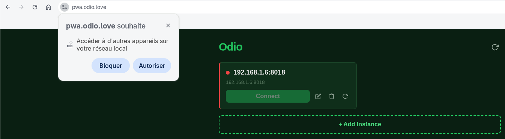
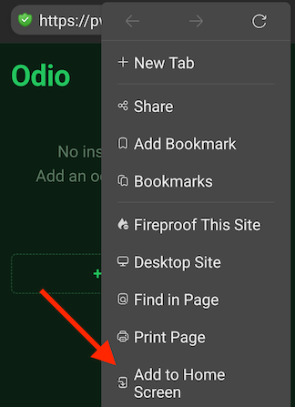
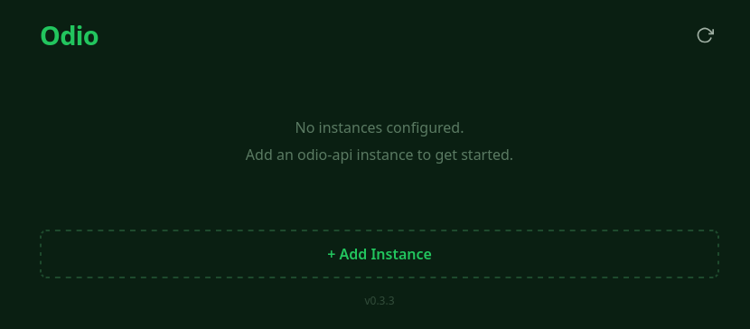
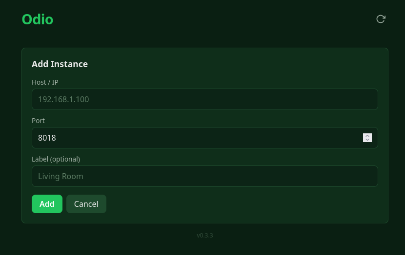
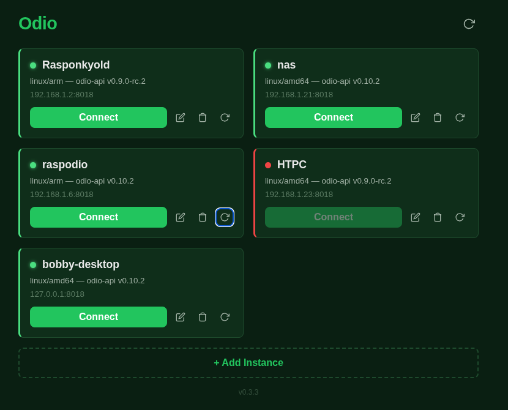

import { Aside } from '@astrojs/starlight/components';

The [odio application](https://pwa.odio.love) is a web app that lets you manage all your odio nodes from one place. Install it from your browser on your phone or desktop.

## Installation

1. Open [pwa.odio.love](https://pwa.odio.love) in your browser.
2. Tap "Install" or "Add to Home Screen" when prompted.
3. Add your nodes by hostname or IP.

**Browser support.** On mobile, installation works on Chrome, Edge, Safari, and Firefox. On some browsers like DuckDuckGo, the option is in the three-dot menu. On desktop, Chrome and Edge can install the app; Firefox desktop cannot be used with pwa.odio.love at all, see the mixed-content note below.

<Aside type="caution">
pwa.odio.love is served over HTTPS while odio nodes on your LAN typically run over HTTP. This is mixed content, and browsers handle it differently:

- **Chrome 142+** prompts for Local Network Access and works once granted.
- **Safari** blocks mixed content with no exemption.
- **Firefox** only exempts `localhost`, so nodes on your LAN are blocked.

If your browser falls in one of the blocked categories, see [Other setups](#other-setups) below.
</Aside>





## How it works

The application loads each node's [embedded web UI](/guides/embedded-ui/) in an iframe. You get the full interface of each node, playback, audio routing, Bluetooth, services, power, all accessible from a single app.

## Why manual configuration?

A web app cannot perform mDNS/Zeroconf discovery — browsers don't have access to UDP multicast. That's why you need to add your nodes manually by hostname or IP.

On first launch, click **+ Add Instance** and enter the address of your odio node:



Enter the host/IP, port (default 8018), and an optional label for your node:



A CIDR-based subnet scanner is tracked in [odio-pwa#12](https://github.com/b0bbywan/odio-pwa/issues/12) as a workaround for the missing mDNS. Contributions welcome, a nice entry point for frontend devs who want to try Svelte.

## Multiple nodes

Add as many nodes as you have. Each card shows the node name, architecture, odio-api version, and connection status. Click **Connect** to open the node's interface.



## Other setups

pwa.odio.love is the easiest path, but it's not the only one. If you only have one node, or if your browser blocks mixed content or doesn't support PWA install, these alternatives may fit better.

### Single node: bookmark the embedded UI

If you only have one odio node, the PWA isn't really needed. Bookmark the node's [embedded web UI](/guides/embedded-ui/) directly, it's the simplest option, especially on a browser that doesn't allow PWA install.

### Multiple nodes, no install: self-host over HTTP

If you have several nodes and don't need the installable-app experience, self-host the PWA on your LAN over plain HTTP. No mixed-content restriction, no CORS setup, just bookmark the address and access it from any device on your network. See [Self-hosting](#self-hosting) below.

### Multiple nodes with install: self-host over HTTPS

To keep PWA install while avoiding mixed-content blocks, self-host the PWA over HTTPS on a local address, for example with [Traefik](https://traefik.io/) and Let's Encrypt. In this case, add your self-hosted origin to `api.cors.origins` in each node's [config.yaml](/api/configuration/#minimal-config) so the API accepts requests from your PWA.

## Self-hosting

Self-hosting has always been possible by cloning and building the repo yourself. [v0.3.4](https://github.com/b0bbywan/odio-pwa/releases/tag/v0.3.4) makes it easier with an official Docker image and a ready-to-deploy static zip.

<Aside>Thanks to [@pbattino](https://github.com/pbattino) ([odios#47](https://github.com/b0bbywan/odios/issues/47)) for the nudge to package and document self-hosting properly.</Aside>

- **Docker** (multi-arch, amd64 + arm64):

  ```bash
  docker run -d -p 8080:80 --restart unless-stopped \
    --name odio-pwa ghcr.io/b0bbywan/odio-pwa:latest
  ```

  The image is based on `nginx:alpine` with SPA fallback and PWA-aware cache headers already configured.

- **Static zip** — download `odio-pwa-<version>.zip` from the [releases page](https://github.com/b0bbywan/odio-pwa/releases) and serve the extracted files from any web server. Make sure unrecognized paths fall back to `/index.html`, and set `Cache-Control: no-cache` on `/index.html`, `/sw.js`, and `/registerSW.js`.

## Updates

An arrow indicator appears next to the app version when a newer GitHub release is available, click it to open the release notes. To include prereleases (for testing RCs), run in the browser devtools console:

```js
localStorage.setItem('odio-include-prereleases', 'true')
```
