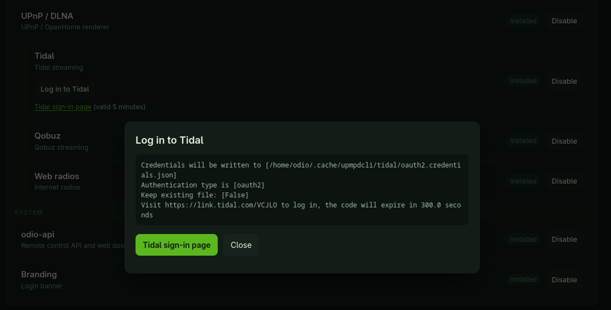

import { Aside } from '@astrojs/starlight/components';

Tidal and Qobuz streaming are available via [upmpdcli](https://www.lesbonscomptes.com/upmpdcli/). With either plugin enabled, upmpdcli becomes a full music library: you can browse, search, and play directly from any UPnP control point (e.g. BubbleDS Next or BubbleUPnP), in addition to its role as a [DLNA renderer](/guides/dlna/).

Both plugins ship with the default odio installation (the installer asks, and defaults to yes). What remains is authenticating with your account, a button on the [settings page](/operations/settings/#components) since 2026.9.0b1, as walked through below for Tidal. The full parameter list is in the official documentation:

- [Tidal streaming parameters](https://www.lesbonscomptes.com/upmpdcli/pages/upmpdcli-manual.html#_tidal_streaming_service_parameters)
- [Qobuz streaming parameters](https://www.lesbonscomptes.com/upmpdcli/pages/upmpdcli-manual.html#_qobuz_streaming_service_parameters)

<Aside>Setup contributed by [Antoine L](https://github.com/b0bbywan/odios#contributors-), tested on a Raspberry Pi 2 (2014) running a fresh odio installation. Merci Antoine!</Aside>

There are two ways to play Tidal on the node: enable upmpdcli's Tidal plugin, which adds Tidal to the node's UPnP library for any control point, or use a control point that ships its own Tidal integration, like [BubbleUPnP](#tidal-via-bubbleupnps-own-integration), which needs no configuration on the node at all.

## Tidal in the node's library (upmpdcli plugin)

Since [2026.9.0b1](https://github.com/b0bbywan/odios/releases/tag/2026.9.0b1), the installer enables the plugin when the Tidal feature is installed, and signing in is a button on the node's [settings page](/operations/settings/#components): open the Tidal row, click **Log in to Tidal**, and follow the link it shows, valid for five minutes, from any browser. The token lands in `~/.cache/upmpdcli/tidal/oauth2.credentials.json` in the odio user's home. Then [restart upmpdcli](#restart-upmpdcli).



Stream quality and country code keep their defaults. To change them, edit upmpdcli's config as the odio user over SSH:

```bash
sudo su - odio
nano ~/.config/upmpdcli/upmpdcli.conf
```

In the `Tidal streaming service parameters` section:

```ini
tidalaudioquality = HI_RES_LOSSLESS
tidaloverridecountrycode = FR
```

<details>
<summary>Manual setup on releases before 2026.9.0b1</summary>

upmpdcli runs as the **odio** user and reads its config from odio's home directory, so every step below starts by switching to that user from your SSH session:

```bash
sudo su - odio
```

### 1. Enable the Tidal plugin

As the odio user, edit the config (it belongs to odio, so from any other user it appears read-only):

```bash
nano ~/.config/upmpdcli/upmpdcli.conf
```

In the `Tidal streaming service parameters` section, set:

```ini
tidaluser = your@email.example
tidalaudioquality = HI_RES_LOSSLESS
tidaloverridecountrycode = FR
```

- `tidaluser` is what activates the plugin. The upmpdcli manual describes it as a bogus variable: it isn't checked against your Tidal account, which is authenticated in the next step.
- `tidalaudioquality` sets the maximum stream quality.
- `tidaloverridecountrycode` overrides the country code; adjust to yours.

### 2. Authenticate with your Tidal account

Still as the odio user, run the credentials helper shipped with the plugin:

```bash
python3 /usr/share/upmpdcli/cdplugins/tidal/get_credentials.py -f ~/.cache/upmpdcli/tidal/oauth2.credentials.json
```

The script prints a Tidal login URL. Open it in a browser on any device and sign in. The script then writes the OAuth2 token to `~/.cache/upmpdcli/tidal/oauth2.credentials.json` (no need to create the directory beforehand) and confirms with:

```
Displaying credentials file for type [/home/odio/.cache/upmpdcli/tidal/oauth2.credentials.json], json format:
...
```

</details>

### Restart upmpdcli

Restart `upmpdcli.service` to pick up the new config and credentials, from the [embedded UI](/control/embedded-ui/)'s Services panel (one click on the restart icon next to the service), or from the same odio terminal:

```bash
systemctl --user restart upmpdcli.service
```

Tidal then joins the node's UPnP library alongside the [built-in webradio sources](/guides/webradios/#built-in-upmpdcli-sources), so you can browse, search, and play it from any control point.

## Tidal via BubbleUPnP's own integration

[BubbleUPnP](https://play.google.com/store/apps/details?id=com.bubblesoft.android.bubbleupnp) on Android also ships its own Tidal integration in its Local and Cloud library, independent of the upmpdcli plugin, so nothing needs to be configured on the node. In the tested setup, BubbleUPnP detected the odio node on its own and asked for a one-time sign-in to Tidal; from there you can browse your Tidal library in the app and direct playback to the node like to any [DLNA renderer](/guides/dlna/).

## Qobuz

Qobuz is configured in the same file, through its [own set of parameters](https://www.lesbonscomptes.com/upmpdcli/pages/upmpdcli-manual.html#_qobuz_streaming_service_parameters). We don't have a tested walkthrough yet; if you have set up Qobuz with odio, help us improve this page — [open an issue](https://github.com/b0bbywan/odios/issues).
