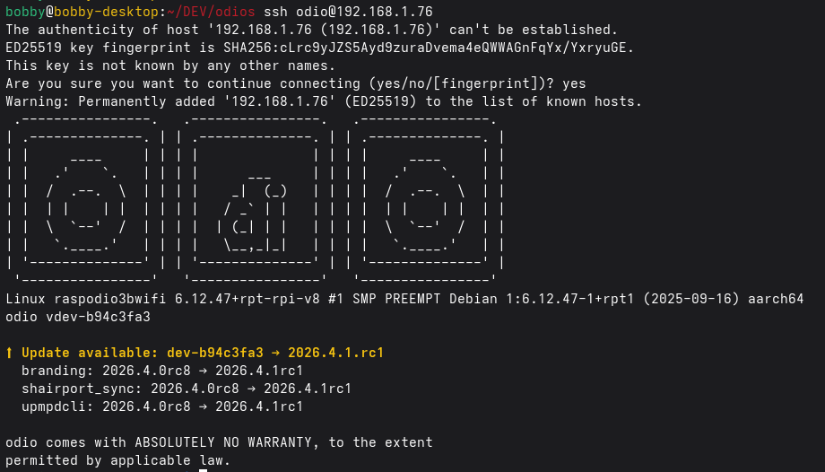

import { Aside } from '@astrojs/starlight/components';

Since [2026.4.1rc3](https://github.com/b0bbywan/odios/releases/tag/2026.4.1rc3), each install ships an `odio-upgrade` helper. It re-runs the installer with the feature selection from the previous run, no flags to remember:

```bash
odio-upgrade
```

`--version <tag>` targets a specific release, `--dry-run --force` prints the derived `INSTALL_*` env without applying anything. Same effect via `systemctl --user start odio-upgrade` if you'd rather have the run land in the journal.

The plain installer entry-point still works the same way and remains the path for cold installs:

```bash
curl -fsSL https://beta.odio.love/install | bash
```

The installer is fully idempotent, safe to re-run at any time to update or repair. When a configuration file has been modified, it creates a `<config>.bak` backup before applying changes. If the file ends up identical, no backup is kept. This applies to `/etc/bluetooth/main.conf`, `~/.config/mpd/mpd.conf`, `~/.config/mpd-discplayer/config.yaml`, `~/.config/odio-api/config.yaml`, `~/.config/pipewire/pipewire-pulse.conf`, `~/.config/shairport-sync/shairport-sync.conf`, `~/.config/spotifyd/spotifyd.conf`, and `~/.config/upmpdcli/upmpdcli.conf`.

## Bootstrap on a pre-rc3 install

Any install older than rc3 lacks the `odio-upgrade` helper. Each release also publishes it as a standalone asset, so it can run before being installed:

```bash
curl -fsSL https://github.com/b0bbywan/odios/releases/latest/download/odio-upgrade -o /tmp/odio-upgrade
chmod +x /tmp/odio-upgrade
/tmp/odio-upgrade
```

It reads `~/.cache/odio/state.json` when present (rc1/rc2), and falls back to reconstructing the install from `dpkg` for anything older with no state file at all. The next run finds the helper installed in `/usr/local/bin` and the state file at `/var/cache/odio/state.json`, so the bootstrap is a one-time step.

## Pin a specific version

Pass any [release tag](https://github.com/b0bbywan/odios/releases) to `--version`:

```bash
odio-upgrade --version 2026.4.1rc3
```

For a cold install, the installer entry-point takes the same tag:

```bash
curl -fsSL https://github.com/b0bbywan/odios/releases/download/2026.4.1rc3/install.sh | ODIOS_VERSION=2026.4.1rc3 bash
```

## Skip what you don't need

Not every release is worth applying. Upgrades are skippable, you can wait for the next one that brings something you actually care about. The version check described below tells you what's available, not what you have to run.

## Detect available upgrades

Since [2026.4.1rc1](https://github.com/b0bbywan/odios/releases/tag/2026.4.1rc1), each node shows its own update status in the MOTD (message of the day) when you SSH in:



The notice lists the overall version bump and the roles whose version actually changed between the installed state and the latest release. If nothing changed, the notice is absent.

A systemd user timer reruns the check daily with a randomized delay. To trigger it on demand:

```
odio@raspodio:~ $ odio-check-upgrade
Upgrades available: dev-8e978895 → 2026.4.1rc3
```

Three files back this check:

- **Local state** — `/var/cache/odio/state.json`, written by the installer after each successful run. Tracks the odios version, install mode, target user, per-role versions, opt-in features, and explicit opt-outs. Since rc3 the file is system-wide (`0664 root:users`), readable by any account in the `users` group, so the timer and helper don't need root to read it:

  ```json
  {
      "odios": "2026.4.1rc3",
      "install_mode": "live",
      "target_user": "odio",
      "roles": {
          "branding": "2026.4.1rc3",
          "bluetooth": "2026.4.0rc5",
          "common": "2026.4.1rc3",
          "mpd": "2026.4.0rc7",
          "mpd_discplayer": "2026.4.0rc7",
          "odio_api": "2026.4.0rc7",
          "pulseaudio": "2026.4.1rc3",
          "shairport_sync": "2026.4.1rc1",
          "upmpdcli": "2026.4.1rc3",
          "upgrade": "2026.4.1rc3"
      },
      "roles_excluded": ["snapclient", "spotifyd"],
      "features": ["qobuz"],
      "features_excluded": ["tidal", "upnpwebradios"]
  }
  ```

- **Published manifest** — [odio.love/manifest.json](https://odio.love/manifest.json), generated by CI on each release with the same shape. Each role version is the last odios release that touched that role.

- **Check result** — `/var/cache/odio/upgrades.json`, written by `odio-check-upgrade` after comparing state and manifest. This is what the MOTD reads from:

  ```json
  {
    "current": "2026.4.1rc2",
    "latest": "2026.4.1rc3",
    "upgrade_available": true,
    "roles": [],
    "checked_at": "2026-04-26T19:34:13Z"
  }
  ```

## Opt out of a role or feature

`odio-upgrade` is pure opt-out: only entries in `roles_excluded` and `features_excluded` map to `INSTALL_*=N`. Everything else, including roles or features added in a later release that your `state.json` doesn't yet mention, gets `INSTALL_*=Y`.

To keep something off on the next upgrade, edit `/var/cache/odio/state.json` and add it to the matching `_excluded` list, for example to keep `branding` and `upnpwebradios` off:

```diff
   "roles_excluded": [
-    "snapclient", "spotifyd"
+    "snapclient", "spotifyd", "branding"
   ],
   "features_excluded": [
-    "tidal"
+    "tidal", "upnpwebradios"
   ]
```

Then verify and apply:

```bash
odio-upgrade --dry-run --force   # print the derived INSTALL_* flags
odio-upgrade
```

Removing an entry opts back in.

## What's next

The RFC behind this flow ([RFC: Targeted upgrade system for odio](https://github.com/b0bbywan/odios/discussions/34)) is partly landed: detection, state schema, and a single-command upgrade are in. Targeted role upgrades (`ansible-pull --tags <changed_roles>` instead of a full installer re-run) and integration in the [odio application](/guides/pwa/) via `go-odio-api` will land in a follow-up PR.
