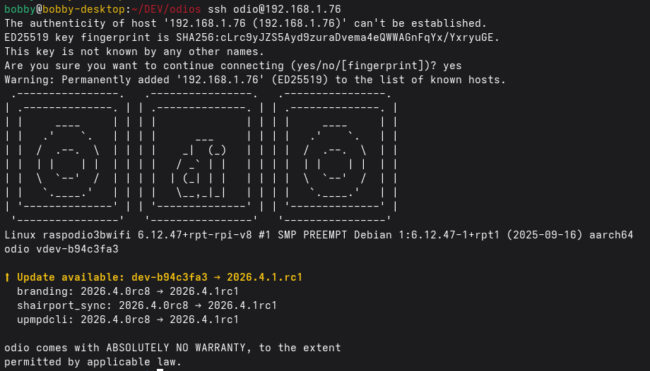

## Detect available upgrades

Since [2026.4.1rc1](https://github.com/b0bbywan/odios/releases/tag/2026.4.1rc1), each node shows its own update status in the MOTD (message of the day) when you SSH in:



The notice lists the overall version bump and the roles whose version actually changed between the installed state and the latest release. If nothing changed, the notice is absent.

A systemd user timer (`odio-check-upgrade.timer`) reruns the check daily with a randomized delay. Run the helper on demand to see the result on stdout:

```
odio@raspodio:~ $ odio-upgrade check
Upgrades available: dev-8e978895 → 2026.5.0b1
```

Or trigger the user unit instead, with the result landing in the user journal:

```bash
systemctl --user start odio-check-upgrade.service
```

Before [2026.5.0b1](https://github.com/b0bbywan/odios/pull/56), the check shipped as a separate `odio-check-upgrade` script. It is now the `check` subcommand of `odio-upgrade`, with the legacy binary removed on upgrade. The timer and service unit names are unchanged.

## Upgrade

Since [2026.4.2b1](https://github.com/b0bbywan/odios/releases/tag/2026.4.2b1), each install ships an `odio-upgrade` helper. It re-runs the installer with the feature selection from the previous run, no flags to remember. Trigger it via the systemd user unit, with the run landing in the user journal:

```bash
systemctl --user start odio-upgrade.service
```

The unit takes no arguments, so reach for the script directly whenever you need flags. Since [2026.5.0b1](https://github.com/b0bbywan/odios/pull/56), `odio-upgrade` is split into two subcommands: `apply` (the upgrade itself, used by the systemd unit) and `check` (refreshes `/var/cache/odio/upgrades.json`, wired to the daily timer above). `--version <tag>` targets a specific [release tag](https://github.com/b0bbywan/odios/releases), `--dry-run --force` prints the derived env without applying anything:

```bash
odio-upgrade apply
odio-upgrade apply --version 2026.4.2b1
odio-upgrade apply --dry-run --force
odio-upgrade check                        # refresh upgrades.json now
```

The bare `odio-upgrade` form keeps working as an alias of `apply`, so existing muscle memory and scripts are unaffected.

Since 2026.5.0b1, `apply` only re-runs the roles that actually changed in the target release. On a Pi B+ where the full playbook takes around two hours, that brings most upgrades down to the handful of roles that bumped (see [smart upgrade](https://github.com/b0bbywan/odios/issues/54)).

Open PRs are published the same way, as `pr-<N>` pre-releases (see [CI/CD](/community/ci-cd/#odios-releases)), so testing a PR before merge is the same call:

```bash
odio-upgrade apply --version pr-52
```

The installer is fully idempotent, safe to re-run at any time to update or repair. When a configuration file has been modified, it creates a `<config>.bak` backup before applying changes. If the file ends up identical, no backup is kept. This applies to the Bluetooth, MPD, mpd-discplayer, odio-api, PipeWire, shairport-sync, spotifyd, and upmpdcli config files.

## Bootstrap and cold install

For a cold install, the plain installer entry-point is the path:

```bash
curl -fsSL https://beta.odio.love/install | bash
```

It also takes a tag for pinning:

```bash
curl -fsSL https://github.com/b0bbywan/odios/releases/download/2026.4.2b1/install.sh | ODIOS_VERSION=2026.4.2b1 bash
```

Any install older than 2026.4.2b1 lacks the `odio-upgrade` helper. Each release also publishes it as a standalone asset, so it can run before being installed:

```bash
curl -fsSL https://odio.love/upgrade -o /tmp/odio-upgrade
chmod +x /tmp/odio-upgrade
/tmp/odio-upgrade
```

It reads `~/.cache/odio/state.json` when present (2026.4.1rc1/rc2), and falls back to reconstructing the install from `dpkg` for anything older with no state file at all. The next run finds the helper installed in `/usr/local/bin` and the state file at `/var/cache/odio/state.json`, so the bootstrap is a one-time step.

## Opt out of a role or feature

`odio-upgrade` is pure opt-out: only entries in `roles_excluded` and `features_excluded` map to `INSTALL_*=N`. Everything else, including roles or features added in a later release that your `state.json` doesn't yet mention, gets `INSTALL_*=Y`.

To keep something off on the next upgrade, edit `/var/cache/odio/state.json` and add it to the matching `_excluded` list, for example to keep `branding` and `upnpwebradios` off:

```diff
   "roles_excluded": [
-    "snapclient", "spotifyd"
+    "snapclient", "spotifyd", "branding"
   ],
   "features_excluded": [
-    "tidal"
+    "tidal", "upnpwebradios"
   ]
```

Then verify and apply:

```bash
odio-upgrade --dry-run --force   # print the derived INSTALL_* flags
odio-upgrade
```

Removing an entry opts back in.

<details>
<summary>State files behind the upgrade flow</summary>

Three files back the detection and upgrade flow:

- **Local state** — `/var/cache/odio/state.json`, written by the installer after each successful run. Tracks the odios version, install mode, target user, per-role versions, opt-in features, explicit opt-outs, and a `release_history` of the last odios versions installed on this node. Since 2026.4.2b1 the file is system-wide (`0664 root:users`), readable by any account in the `users` group, so the timer and helper don't need root to read it:

  ```json
  {
      "features": [
          "tidal",
          "qobuz",
          "upnpwebradios",
          "mympd"
      ],
      "features_excluded": [],
      "install_mode": "live",
      "odios": "2026.4.2b2",
      "release_history": [
          "2026.4.1rc2",
          "2026.4.2b2"
      ],
      "roles": {
          "bluetooth": "2026.4.0rc5",
          "branding": "2026.4.2b1",
          "common": "2026.4.2b2",
          "mpd": "2026.4.2b2",
          "mpd_discplayer": "2026.4.2b1",
          "odio_api": "2026.4.2b2",
          "pulseaudio": "2026.4.2b1",
          "shairport_sync": "2026.4.1rc1",
          "snapclient": "2026.4.0rc5",
          "spotifyd": "2026.4.2b1",
          "upgrade": "2026.4.2b2",
          "upmpdcli": "2026.4.2b2"
      },
      "roles_excluded": [],
      "target_user": "odio"
  }
  ```

- **Published manifest** — [odio.love/manifest.json](https://odio.love/manifest.json), generated by CI on each release with the same shape. Each role version is the last odios release that touched that role.

- **Check result** — `/var/cache/odio/upgrades.json`, written by `odio-upgrade check` after comparing state and manifest. This is what the MOTD reads from:

  ```json
  {
    "current": "2026.4.2b2",
    "latest": "2026.4.2b2",
    "upgrade_available": false,
    "roles": [],
    "checked_at": "2026-04-30T13:57:36Z"
  }
  ```

</details>

## What's next

The RFC behind this flow ([RFC: Targeted upgrade system for odio](https://github.com/b0bbywan/odios/discussions/34)) is partly landed. In with 2026.4.2b1: detection, state schema v2, single-command upgrade, post-install health check, and a [test-upgrade CI matrix](/community/ci-cd/#odios-releases) that walks every supported `state.json` generation end to end before a release ships.

Coming with [2026.4.2b2](https://github.com/b0bbywan/odios/pull/52): the installer flips its defaults so every prompt is `Y`-by-default, and `derive_install_env` switches to explicit `Y` for installed entries / `N` for excluded ones / unset for anything unknown — so a new sub-feature added in a later release self-installs without a state-file edit. The PR demonstrates the pattern itself: myMPD lands as a sub-feature of the [`mpd` role](https://github.com/b0bbywan/odios/blob/main/installer/ansible/roles/mpd/tasks/mympd.yml) (`install_mympd`) rather than a new top-level role, so it follows whatever you decided about MPD on the existing install.

Coming with [2026.5.0b1](https://github.com/b0bbywan/odios/pull/56): [smart upgrade](https://github.com/b0bbywan/odios/issues/54) lands, so an upgrade only re-runs the roles that actually changed in the target release. The `odio-upgrade` CLI also gains explicit `check` and `apply` subcommands, with the bare invocation kept as an alias of `apply`.

Still pending: surfacing the same detector/executor backend, planned for [go-odio-api](https://github.com/b0bbywan/go-odio-api), into both the [odio application](/guides/pwa/) and the [Home Assistant integration](/guides/home-assistant/), so a one-click upgrade lands in the UI you already use.

The UI flow will need the target user to be `odio`, since the upgrade fires through go-odio-api's executor and lands on `odio-upgrade.service` as an `odio`-user systemd unit. If you flashed the node with a different user (in [Raspberry Pi Imager](/guides/installation/#getting-started) or passed `--user` to the installer), the UI path will still be reachable by running a second go-odio-api instance in your own user session, with passwordless sudo and its own config on a port other than 8018, alongside the system instance running as `odio`. The CLI path (`odio-upgrade`) is independent of the user choice.
