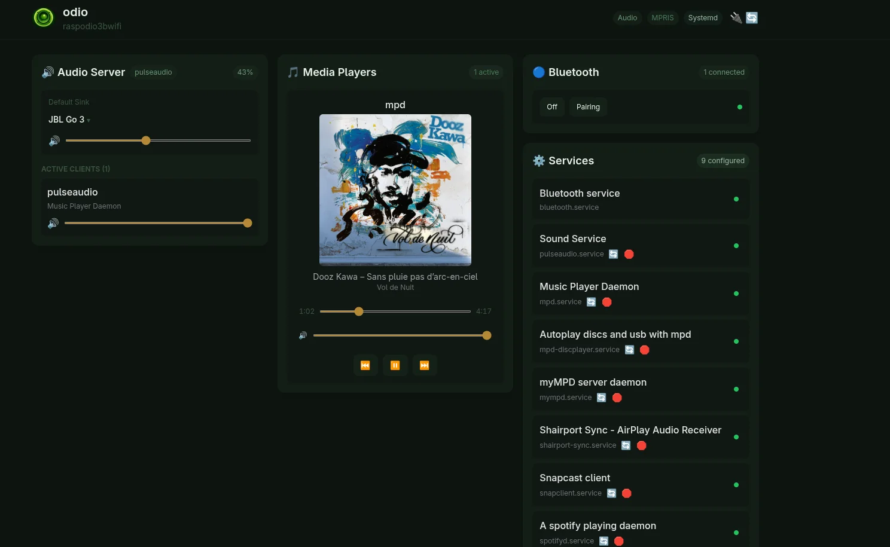

import { Image } from 'astro:assets';
import malpPlayback from '../../../assets/malp-usb-playback.png';
import malpTracklist from '../../../assets/malp-usb-tracklist.png';

Plug a USB flash drive with audio files into your Pi. After a few seconds, playback starts automatically via [go-mpd-discplayer](https://github.com/b0bbywan/go-mpd-discplayer).

## How it works

[go-mpd-discplayer](https://github.com/b0bbywan/go-mpd-discplayer) monitors udev for USB block device events. When a stick is inserted, it mounts the filesystem via udisks2, triggers an MPD database update, and starts playback. The previous queue is replaced with the stick's content. See [MPD Disc Player](/disc-player/overview/) for installation, configuration, and standalone usage.

Video files (.mkv, .mp4, etc.) are ignored automatically.

When you remove the stick, its tracks are removed from the active queue.

### Polkit rule

Mounting USB devices from a user session requires a polkit rule to authorize udisks2 operations. The odio installer deploys this automatically:

```
/etc/polkit-1/rules.d/80-mpd-udisks.rules
```

```javascript
polkit.addRule(function(action, subject) {
    if ((action.id == "org.freedesktop.udisks2.filesystem-mount" ||
         action.id == "org.freedesktop.udisks2.filesystem-mount-other-seat") &&
        subject.user == "odio") {
        return polkit.Result.YES;
    }
});
```

On headless systems, the odio installer deploys this polkit rule to allow the odio user to mount USB filesystems as a normal user, without sudo.

On desktop systems with a graphical session, this rule is not needed — udisks2 already grants these permissions.

## Multiple sticks

If you plug in a second stick, it replaces the first in the queue. The first stick's content remains browsable in MPD's database as long as it stays plugged in.

## Playback controls

Same as any other MPD source — controllable from the odio application, Home Assistant, or any MPD client.



Cover art in the embedded UI for USB playback ships since odio-api [v0.11.0](https://github.com/b0bbywan/go-odio-api/releases/tag/v0.11.0), which serves local cover art (embedded tags, or `cover.jpg`/`cover.png`/`cover.tiff`/`cover.bmp` next to the audio files) over the API.

From an MPD client like MALP, cover art and full track metadata are available — as long as the USB drive contains a `cover.jpg`, `cover.png`, `cover.tiff`, or `cover.bmp` in the same folder as the audio files (or embedded art in the file tags).

<div class="screenshot-carousel">
	<figure>
		<Image src={malpPlayback} alt="MALP Android app playing a USB track with album cover art, seek bar, and playback controls" />
		<figcaption>Playback view, cover art and transport from MALP</figcaption>
	</figure>
	<figure>
		<Image src={malpTracklist} alt="MALP showing the full USB tracklist with artist, album, and track durations" />
		<figcaption>Tracklist view, full metadata per track</figcaption>
	</figure>
</div>
