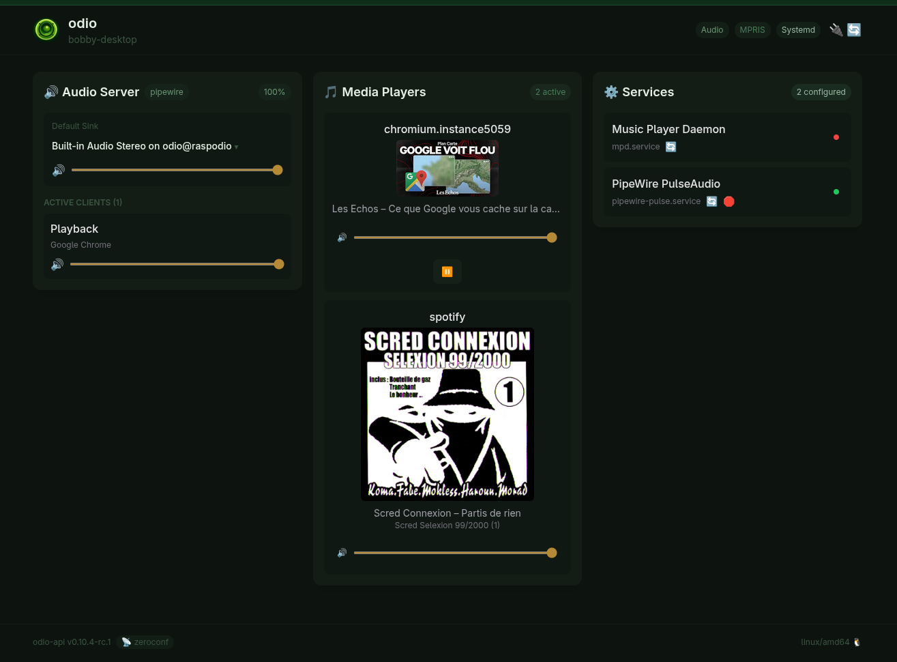

Your desktop or laptop already handles your music, browser, games, and video calls. odio plugs into that, you don't change anything.

## Network audio

An odio node advertises itself as a network audio sink via [PulseAudio Zeroconf](/guides/network-audio/). Once your desktop discovers it, the node appears as a regular audio output in your system sound settings.

Select it, and everything plays through the odio node: browser tabs, media players, games, system sounds, all of it, transparently. This works with both PipeWire and PulseAudio desktops. The odio node must be on a wired connection. The desktop can connect over WiFi, but it's not reliable.

Connected clients appear in the [odio application](/guides/pwa/) and [Home Assistant](/guides/home-assistant/) with per-client volume and mute control.

## AirPlay

On macOS, use Control Center or the AirPlay menu. On Linux with PulseAudio, the odio node appears natively in your sound settings as an AirPlay remote sink, no extra software needed. The [AirPlay](/guides/airplay/) session appears as a controllable media player in the odio stack.

## Snapcast

With PipeWire, your desktop audio can be sent to a [Snapserver](/guides/snapcast/) via `libpipewire-module-snapcast-discover`. The Snapserver distributes it to every odio node running Snapclient, synchronized across all rooms.

## Unified control with go-odio-api

Install [go-odio-api](/api/overview/) on the desktop itself and it discovers every MPRIS player in the session: browser tabs, Spotify, native media apps. The [network sink](/guides/network-audio/) of a remote odio node stays selectable as the default output, so audio plays on the Pi while control and metadata aggregate on the desktop.

## Control

Open the [embedded web UI](/guides/embedded-ui/) in your browser at `http://<node>.local:8018/ui` to control playback, volume, Bluetooth, and services.
