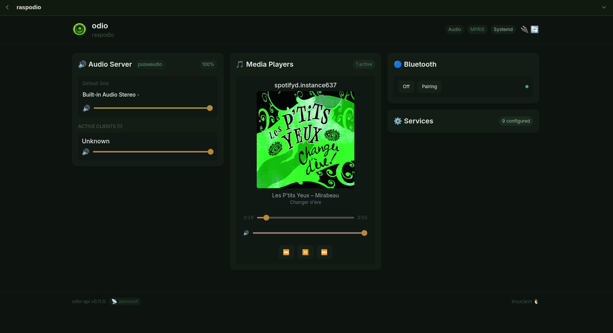

import { Aside } from '@astrojs/starlight/components';
import { Image } from 'astro:assets';
import desktopUi from '../../assets/desktop-embedded-ui.png';
import embeddedUi from '../../assets/embedded-ui.webp';
import multiSourceUi from '../../assets/multi-source-embedded-ui.png';
import nasUi from '../../assets/nas-embedded-ui.png';
import raspodioUi from '../../assets/raspodio-embedded-ui.png';
import htpcUi from '../../assets/htpc-embedded-ui.png';

	<figure>
		<Image src={embeddedUi} alt="odio embedded UI on a Raspberry Pi with PulseAudio, Spotifyd playing, and Bluetooth pairing controls" />
		<figcaption>Basic Raspberry Pi — PulseAudio, Spotifyd, Bluetooth pairing</figcaption>
	</figure>
	<figure>
		<Image src={multiSourceUi} alt="odio embedded UI on a Raspberry Pi receiving audio from a phone over Bluetooth, with PulseAudio as audio server and Bluetooth, MPD, mpd-discplayer, Shairport-Sync, Snapclient, and Spotifyd as managed services" />
		<figcaption>Multi-source Raspberry Pi — Bluetooth phone in, plus MPD, AirPlay, CD/USB autoplay, Snapcast client, Spotifyd</figcaption>
	</figure>
	<figure>
		<Image src={nasUi} alt="odio embedded UI on a NAS-style node with MPD playing 2Pac and MiniDLNA, MPD, Snapcast server, and Docker as managed services" />
		<figcaption>NAS — MiniDLNA, MPD, Snapcast server, Docker</figcaption>
	</figure>
	<figure>
		<Image src={desktopUi} alt="odio embedded UI on a Linux desktop with PipeWire as audio server, Spotify playing, and MPD and PipeWire-Pulse as managed services" />
		<figcaption>Linux desktop — PipeWire, Spotify</figcaption>
	</figure>
	<figure>
		<Image src={htpcUi} alt="odio embedded UI on an HTPC with PipeWire, Kodi playing with cover art, and Bluetooth, Netflix, YouTube, tv.orange.fr, Kodi, and PipeWire PulseAudio as managed services" />
		<figcaption>HTPC — PipeWire, Kodi, Netflix/YouTube kiosks</figcaption>
	</figure>

odio turns a Raspberry Pi (or any Debian-based system) into a complete audio streamer: Bluetooth speaker, AirPlay 2, Spotify Connect, UPnP/DLNA, multi-room, CD player, USB playback — all running in your user session.

<Aside type="note">
**odio** is the streamer — the complete, ready-to-install audio system. The **ecosystem** is the set of standalone components it's built from ([go-odio-api](/api/overview/), [go-mpd-discplayer](/disc-player/overview/), [go-odio-notify](/notify/overview/), etc.), each usable independently on any Linux system. This documentation covers both.
</Aside>

## How you control it

odio is the streamer. The API and its clients (embedded UI, application, Home Assistant) act as a remote control — not a music library browser. You use your existing apps (Spotify, AirPlay, a DLNA control point, an MPD client) to pick what plays. odio gives you unified control over playback.

Every audio source (Spotify, Bluetooth, AirPlay, MPD, ...) exposes itself as an [MPRIS](https://specifications.freedesktop.org/mpris/latest/) player. The [odio API](/api/overview/) discovers them all automatically and provides a single interface to control playback, volume, and services — regardless of the source.

This is what the [embedded web UI](/guides/embedded-ui/), the [odio application](/guides/pwa/), and the [Home Assistant integration](/guides/home-assistant/) all build on.

Get started with the [Installation guide](/guides/installation/).

## An open platform

odio is a platform, not a locked appliance. It builds on standard hardware and proven Linux technologies — PulseAudio, MPRIS, D-Bus, systemd — so you're free to install and run any additional software alongside it. See the [Extensions](/guides/extensions/) page for more, or read [why it's built this way](/community/empowerment/).

## Links

- [odio website](https://odio.love)
- [GitHub](https://github.com/b0bbywan/odios) — issues, discussions, and feature requests
