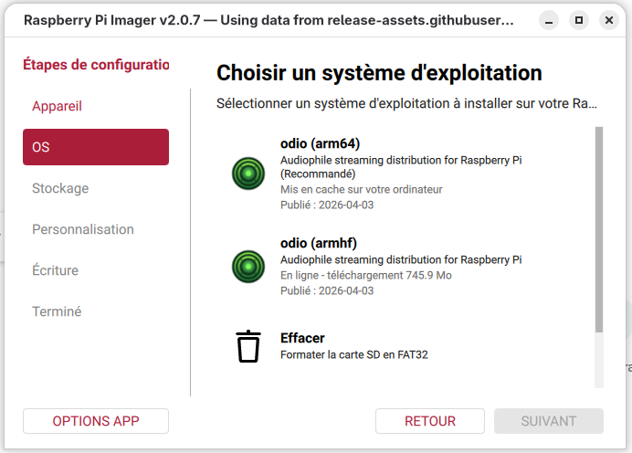

import { Aside, Steps, Tabs, TabItem } from '@astrojs/starlight/components';

Two ways to install odio, same result: same packages, same services, same configuration. On a Raspberry Pi, flash a ready-made image. On an existing Debian 13 (trixie) or Ubuntu system, run the installer.

<Aside type="note">odio is still in beta, stable for daily use. If you encounter any issues, please [open an issue](https://github.com/b0bbywan/odios/issues).</Aside>

<Tabs syncKey="install-method">
<TabItem label="Raspberry Pi (Imager)" icon="seti:image">

<Steps>

1. Install and open [Raspberry Pi Imager](https://www.raspberrypi.com/software/).

2. Go to **Options App** → **Content Repository** → **Use custom URL**, and paste this URL:

   ```txt
   https://odio.love/odio.rpi-imager-manifest
   ```

3. Select **odio** in the operating system list. It is available for armhf (32-bit) and arm64 (64-bit) boards.

   

4. In the Imager settings, configure the hostname, SSH, and WiFi if needed.

   <Aside type="tip">
   **Pick `odio` as the user.** The odio stack always runs under the `odio` user, and choosing it here wires in the UI-driven upgrade by default. A different user is fine for SSH, and the CLI [upgrade flow](/operations/upgrade/) is independent of the choice.
   </Aside>

   Ethernet is recommended over WiFi for reliable audio streaming.

5. Flash the SD card, put it in the Pi and power it on. Your Pi boots ready.

6. Open the [web UI](/control/embedded-ui/) from any browser on your network:

   ```txt
   http://<hostname>.local:8018/ui
   ```

</Steps>

</TabItem>
<TabItem label="Debian / Ubuntu (installer)" icon="linux">

<Steps>

1. On an existing Debian 13 (trixie) or Ubuntu system, run:

   ```bash
   curl -fsSL https://odio.love/install | bash
   ```

2. The installer runs pre-flight checks (OS, architecture, disk space, dependencies), then asks:

   - which **target user** runs the stack (default: `odio`)
   - which **optional components** to install: AirPlay, Spotify Connect, Snapcast, DLNA, CD/USB autoplay

3. It downloads a vendored Ansible archive, runs the playbook, and configures everything. Existing config files are backed up before modification.

4. Open the [web UI](/control/embedded-ui/) from any browser on your network:

   ```txt
   http://<hostname>.local:8018/ui
   ```

</Steps>

The installer is idempotent, safe to re-run to update or repair. For non-interactive installs (CI, automation), all prompts can be bypassed, see the [installer documentation](https://github.com/b0bbywan/odios/tree/main/installer).

<details>
<summary>Example installer output</summary>

```
╔═══════════════════════════════════════════════════════════╗
║                 odio Streamer Installer                   ║
╚═══════════════════════════════════════════════════════════╝

Running pre-flight checks...
✓ OS: debian 13
✓ Architecture: x86_64
✓ Python 3.13
✓ Sudo access available
✓ Disk space: 7994 MB available in /tmp
✓ curl available
✓ Systemd available

Installing python3-jinja2...
✓ python3-jinja2 installed

Downloading odio archive...
✓ Archive extracted

Running Ansible playbook...

PLAY [Odio Streamer Installation] **********************************************

...

═══════════════════════════════════════════════════
  Audio Streaming System - Installation Complete
═══════════════════════════════════════════════════

Hostname: raspodio
User: odio

Core services installed:
  ✓ PulseAudio with network streaming
  ✓ Bluetooth audio (A2DP sink)
  ✓ MPD (Music Player Daemon)
  ✓ Odio API (REST control interface)

Optional services:
  ✓ MPD disc player
  ✓ Spotifyd (Spotify Connect)
  ✓ Shairport Sync (AirPlay)
  ✓ Snapcast client
  ✓ UPnP/DLNA renderer

System should already be running !
Visit http://localhost:8018/ui

═══════════════════════════════════════════════════

Playbook completed in 2m 20s

═══════════════════════════════════════════════════════════
Installation complete!
═══════════════════════════════════════════════════════════
```

</details>
</TabItem>
</Tabs>

## Compatible hardware

| Hardware | Architecture | Install method | Tested on |
|---|---|---|---|
| Raspberry Pi B, B+ | armv6l | Imager, installer | Raspberry Pi OS Lite (Trixie) |
| Raspberry Pi Zero W | armv6l | Imager, installer | — |
| Raspberry Pi 2 | armv7 | Imager, installer | Raspberry Pi OS Lite (Trixie) |
| Raspberry Pi 3B+ | armv7 / arm64 | Imager, installer | Raspberry Pi OS Lite (Trixie) |
| Raspberry Pi 4, 5 | arm64 | Imager, installer | — |
| Raspberry Pi Zero 2 W | arm64 | Imager, installer | — |
| Desktop | x86-64 | installer | Debian 13 Gnome |
| NAS | x86-64 | installer | OpenMediaVault 8 |

For sound output, any DAC HAT supported by the kernel and any USB DAC work, see [DAC and overclocking](#dac-and-overclocking).

<Aside type="tip" title="Running odio on something else?">
A board marked —, another board, a different distribution: if it works (or doesn't), [share your setup in Show and tell](https://github.com/b0bbywan/odios/discussions/categories/show-and-tell). Every report helps fill this table.
</Aside>

## Upgrade

The installer is idempotent, re-run it to upgrade an existing installation. Each node shows available updates in its SSH MOTD (since [2026.4.1rc1](https://github.com/b0bbywan/odios/releases/tag/2026.4.1rc1)), and upgrades can be checked and applied straight from Home Assistant or the web UI (since [2026.6.0b2](https://github.com/b0bbywan/odios/releases/tag/2026.6.0b2)). See [Upgrade](/operations/upgrade/) for the full flow.

## DAC and overclocking

Every DAC HAT supported by the Raspberry Pi kernel works with odio, generic I2S DACs included. Pick yours from the [settings page](/operations/settings/#dac) on port 8021 and reboot (since [2026.9.0b1](https://github.com/b0bbywan/odios/releases/tag/2026.9.0b1)). It writes the `dtoverlay` line to `/boot/firmware/config.txt` and turns the onboard audio off. On older releases, edit the file by hand with the overlay from your DAC manufacturer's documentation.

USB DACs need no configuration: plug one in and it shows up as an output in the PulseAudio section of the [web UI](/control/embedded-ui/).

Overclocking stays a manual edit in the same file:

```ini
# Overclock (useful on older armhf boards like Pi B+ at 700MHz)
arm_boost=1
arm_freq=800
```

## Next steps

Once installed, your odio node is controllable from:

- **[Embedded web UI](/control/embedded-ui/)** — built into the API, accessible from any browser on your network.
- **[Settings page](/operations/settings/)** — upgrades, components, and DAC selection on port 8021, linked from the web UI header.
- **[odio application](https://pwa.odio.love)** — web app installable from your browser, manage all your nodes from one place.
- **[Home Assistant](https://github.com/b0bbywan/odio-ha)** — native integration via HACS. Every feature exposed as HA entities.
- **Any MPD client** — for library browsing and playback control.
- **The REST API** — for automation, scripting, or building your own client.

For a deeper look at how the stack is put together, see [How it works](/guides/how-it-works/).

## Why odio?

odio started as a personal setup in 2020 — a Raspberry Pi wired to a stereo amplifier, replacing a pile of dedicated devices with a single board. After years of daily use and iteration, odio packages that setup for anyone to use. Every component is independent and can be set up from scratch individually.

The full journey that led to odio is documented on [Medium](https://mathieu-requillart.medium.com/my-ultimate-guide-to-the-raspberry-pi-audio-server-i-wanted-introduction-650020d135e1).
