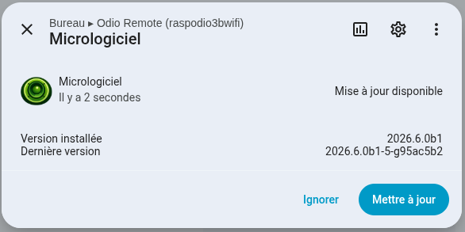

## From Home Assistant and the web UI

The simplest way to check for and apply upgrades is from Home Assistant or the embedded web UI, no SSH required. Both are backed by [go-odio-api](/api/upgrade/) (v0.15.1), which exposes the `odio-check-upgrade` and `odio-upgrade` units, and `/var/cache/odio/upgrades.json`, over its API. A full odios install wires this up automatically since [2026.6.0b2](https://github.com/b0bbywan/odios/releases/tag/2026.6.0b2).

In the [embedded web UI](/control/embedded-ui/), a status badge sits in the header:

- a check mark when the node is up to date, click to re-check;
- an up arrow when an upgrade is available, click to start it (with a confirmation);
- a progress ring while a run is in flight;
- a red alert badge when the last run failed, hover to reveal the up arrow and retry; it persists until the next run.


In [Home Assistant](/control/home-assistant/), the node carries a native **Firmware** update entity (`update.odio_remote_<hostname>_firmware`). It tracks the installed and latest versions, shows an **Install** button when the server allows starting an upgrade, and reports live progress during a run. Detection is server-driven over SSE, so HA never polls.



Both reflect whatever the node's detector reports and trigger the same units, see the [upgrade API](/api/upgrade/) for the contract behind them.

Since [2026.9.0b1](https://github.com/b0bbywan/odios/releases/tag/2026.9.0b1), the node's [settings page](/operations/settings/#upgrade) on port 8021 shows the same check result, with the roles that would move, and an **Apply now** button that starts the same unit. It is also where components get enabled or disabled ahead of a run, see [below](#opt-out-of-a-role-or-feature).

## Check for upgrades from the command line

Each node shows its update status in the MOTD when you SSH in:


The notice lists the overall version bump and the roles whose version actually changed. If nothing changed, the notice is absent.

A systemd user timer (`odio-check-upgrade.timer`) reruns the check daily. Run it on demand to see the result on stdout:

```
odio@raspodio:~ $ odioctl upgrade check
Upgrades available: 2026.7.0rc2 → 2026.9.0b1
  upgrade: 2026.7.0rc2 → 2026.9.0b1
```

The check is the [odioctl](/operations/settings/#command-line) binary since 2026.9.0b1; earlier releases shipped it as the `odio-upgrade check` script.

Or trigger the user unit, with the result landing in the user journal:

```bash
systemctl --user start odio-check-upgrade.service
```

## Apply an upgrade

Trigger the systemd user unit:

```bash
systemctl --user start odio-upgrade.service
```

It re-runs the installer with the feature selection from the previous run. Since [2026.5.0b1](https://github.com/b0bbywan/odios/pull/56), it only re-runs the roles that actually changed in the target release ([smart upgrade](https://github.com/b0bbywan/odios/issues/54)), bringing most upgrades down to a handful of roles.

For flags, call odioctl directly. Applying needs root, which the `odioctl` group gets without a password:

```bash
sudo odioctl upgrade apply                          # same as the unit
sudo odioctl upgrade apply --version 2026.9.0b1     # pin a release tag
sudo odioctl upgrade apply --dry-run --force        # print the invocation, no changes
sudo odioctl upgrade apply --reinstall              # re-run every role, not only the ones that moved
```

Open PRs are published as `pr-<N>` pre-releases (see [CI/CD](/community/ci-cd/#odios-releases)), so testing a PR before merge is the same call. To keep a node on that pre-release for the daily check and the settings page too, set `ODIOCTL_ODIOS_VERSION=pr-84` in `/etc/default/odioctl`:

```bash
sudo odioctl upgrade apply --version pr-84
```

The installer is idempotent and safe to re-run. When a config file has been locally modified, it creates a `<config>.bak` before applying changes; if the file ends up identical, no backup is kept (Bluetooth, MPD, mpd-discplayer, odio-api, PipeWire, shairport-sync, spotifyd, upmpdcli).

## Bootstrap (cold install)

Fresh install:

```bash
curl -fsSL https://beta.odio.love/install | bash
```

Pin a release tag:

```bash
curl -fsSL https://github.com/b0bbywan/odios/releases/download/2026.5.0b1/install.sh | ODIOS_VERSION=2026.5.0b1 bash
```

A node installed before 2026.9.0b1 still carries the `odio-upgrade` script. Run it once, `odio-upgrade apply` or the unit above: that run installs the `odioctl` package, moves the units and sudoers over, and removes the script. From then on, everything on this page applies.

A node installed before 2026.4.2b1 has no helper at all. Releases up to [2026.7.0rc2](https://github.com/b0bbywan/odios/releases/tag/2026.7.0rc2) ship it as a standalone asset, so it can run before being installed and take the same migration path:

```bash
curl -fsSL https://github.com/b0bbywan/odios/releases/download/2026.7.0rc2/odio_upgrade.py -o /tmp/odio-upgrade
chmod +x /tmp/odio-upgrade
/tmp/odio-upgrade
```

## Opt out of a role or feature

Upgrades are opt-out: only entries listed in `state.json` map to `INSTALL_*=N`. Everything else, including roles or features added in a later release, is installed.

Toggle components from the [settings page](/operations/settings/#components) or the command line, for example to keep `branding` and `upnpwebradios` off:

```bash
odioctl components list
odioctl components disable branding
odioctl components disable upnpwebradios
```

Disabling keeps the component installed but stops updating it, nothing is removed. `enable` opts back in. Either way the change only takes effect on the next run:

```bash
sudo odioctl upgrade apply --dry-run --force   # print the derived INSTALL_* flags
sudo odioctl upgrade apply
```

Under the hood, the toggle adds the entry to the matching `_excluded` list in `/var/lib/odio/state.json`, which you can still edit by hand:

```diff
   "roles_excluded": [
-    "snapclient", "spotifyd"
+    "snapclient", "spotifyd", "branding"
   ],
   "features_excluded": [
-    "tidal"
+    "tidal", "upnpwebradios"
   ]
```

<details>
<summary>State files behind the upgrade flow</summary>

Three files back the detection and upgrade flow:

- **Local state** — `/var/lib/odio/state.json`, written by the installer after each successful run and read by `odioctl upgrade apply`. Tracks the odios version, install mode, target user, per-role versions, opt-in features, explicit opt-outs, and a `release_history` of the last odios versions installed on this node. The file is `0660 root:odio` since 2026.9.0b1, so the settings page can edit it as the odio user:

  ```json
  {
      "features": [
          "tidal",
          "qobuz",
          "upnpwebradios",
          "mympd"
      ],
      "features_excluded": [],
      "install_mode": "live",
      "odios": "2026.5.0b1",
      "release_history": [
          "2026.4.2b2",
          "2026.5.0b1"
      ],
      "roles": {
          "bluetooth": "2026.5.0b1",
          "branding": "2026.5.0b1",
          "common": "2026.5.0b1",
          "mpd": "2026.5.0b1",
          "mpd_discplayer": "2026.5.0b1",
          "odio_api": "2026.5.0b1",
          "pulseaudio": "2026.4.2b1",
          "shairport_sync": "2026.4.1rc1",
          "snapclient": "2026.4.0rc5",
          "spotifyd": "2026.5.0b1",
          "upgrade": "2026.5.0b1",
          "upmpdcli": "2026.4.2b2"
      },
      "roles_excluded": [],
      "target_user": "odio"
  }
  ```

- **Published manifest** — [odio.love/manifest.json](https://odio.love/manifest.json), generated by CI on each release with the same shape. Each role version is the last odios release that touched that role.

- **Check result** — `/var/cache/odio/upgrades.json`, written by `odioctl upgrade check` (the daily timer's job, and again after every component toggle) and read by the MOTD and odio-api:

  ```json
  {
    "current": "2026.4.2b2",
    "latest": "2026.4.2b2",
    "upgrade_available": false,
    "roles": [],
    "manifest": {
      "odios": "2026.4.2b2",
      "roles": {
        "bluetooth": "2026.4.0rc5",
        "branding": "2026.4.2b1",
        "common": "2026.4.2b2",
        "mpd": "2026.4.2b2",
        "mpd_discplayer": "2026.4.2b1",
        "odio_api": "2026.4.2b2",
        "pipewire": "2026.4.0rc6",
        "pulseaudio": "2026.4.2b1",
        "shairport_sync": "2026.4.1rc1",
        "snapclient": "2026.4.0rc5",
        "spotifyd": "2026.4.2b1",
        "upgrade": "2026.4.2b2",
        "upmpdcli": "2026.4.2b2"
      }
    },
    "checked_at": "2026-05-07T19:32:34Z"
  }
  ```

</details>
